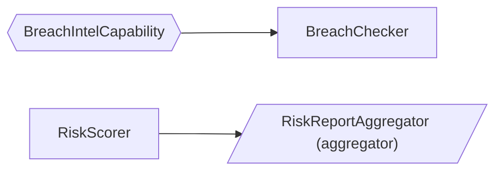

# orcastork

[](https://github.com/Imper-ai/orcastork/actions/workflows/ci.yml)
[](https://www.python.org/downloads/)
[](LICENSE)

A **dataflow orchestration framework** for Python 3.13+ — a library, not a service. You
describe a graph of work, and it runs that graph per session: resumably, exactly once where
it matters, and across process restarts.

It is a **blackboard / dataflow** engine: `Operator`s consume and produce `DataPoint`s,
`Capability`s provide actions, `Aggregator`s write durable outputs, and a session-scoped
`Orchestrator` (supervised by a `SessionOrchestrationManager`) schedules work by **data
readiness** instead of fixed phases. The core is infrastructure-agnostic — it depends only
on a set of **ports** (Protocols); concrete backends are injected as **adapters**.

## Install

```bash
pip install orcastork                   # core: no infrastructure required
pip install 'orcastork[redis,mongo]'    # + the Redis and MongoDB adapters
```

Not on PyPI yet — until the first release, install from git:

```bash
pip install 'orcastork[redis,mongo] @ git+https://github.com/Imper-ai/orcastork.git'
```

## Quickstart

Three classes and a runtime. Nothing here needs Redis, MongoDB or Docker — the in-memory
adapters are a complete implementation of every port, not a stub.

```python
import asyncio
from collections.abc import AsyncIterator
from datetime import datetime, timezone
from typing import Literal

from orcastork.datapoints import BaseDataPoint, DataPointEmission, DataPointTypeConfig
from orcastork.flow import FlowDefinition
from orcastork.ids import NamespaceId, OperatorId, SessionId
from orcastork.manager import SessionOrchestrationManager
from orcastork.operators import Aggregator, Operator, OperatorContext, OperatorPolicy
from orcastork.runtime import build_in_memory_runtime


# 1. The data. Identity is (type, value), so re-observing a value merges instead of duplicating.
class UrlDataPoint(BaseDataPoint[str]):
    type: Literal['url'] = 'url'
    config = DataPointTypeConfig(pii=False, ephemeral=False)


class TitleDataPoint(BaseDataPoint[str]):
    type: Literal['title'] = 'title'
    config = DataPointTypeConfig(pii=False, ephemeral=False)


# 2. The work. It runs because a URL exists, not because anything called it.
class TitleFetcher(Operator):
    operator_id = OperatorId('title_fetcher')
    policy = OperatorPolicy(rerun_on_new_data=True)
    depends_on = frozenset({UrlDataPoint})
    produces = frozenset({TitleDataPoint})

    async def run(self, ctx: OperatorContext) -> AsyncIterator[DataPointEmission]:
        for url in ctx.store.of_type(UrlDataPoint):
            yield TitleDataPoint.emit(f'Title of {url.value}')


# 3. The output. Aggregators are the only writers of curated durable state.
class TitleReport(Aggregator):
    operator_id = OperatorId('title_report')
    policy = OperatorPolicy(rerun_on_new_data=False)
    depends_on = frozenset({TitleDataPoint})

    async def aggregate(self, ctx: OperatorContext) -> None:
        assert ctx.aggregation is not None
        titles = sorted(t.value for t in ctx.store.of_type(TitleDataPoint))
        await ctx.aggregation.upsert('reports', 'titles', {'titles': titles})


async def main() -> None:
    runtime = build_in_memory_runtime()
    manager = SessionOrchestrationManager(runtime)
    flow = FlowDefinition(name='titles', operators=(TitleFetcher, TitleReport))

    now = datetime.now(timezone.utc)
    result = await manager.start_session(
        session_id=SessionId('run-1'),
        namespace_id=NamespaceId('default'),
        flow=flow,
        seed=[UrlDataPoint(value='https://example.com', retrieved_by=OperatorId('seed'),
                           first_retrieved=now, last_retrieved=now)],
    )

    print('status:', result.status)                      # SessionStatus.COMPLETED
    print('operator runs:', dict(result.operator_runs))  # {'title_fetcher': 1, 'title_report': 1}
    record = await runtime.durable.read('reports', 'titles')
    print('durable:', record.document)                   # {'titles': ['Title of https://example.com']}


asyncio.run(main())
```

Nothing declared an order. `TitleFetcher` ran because a `UrlDataPoint` was present;
`TitleReport` ran because gathering went quiet and a `TitleDataPoint` existed. Add a third
operator that depends on `TitleDataPoint` and it schedules itself — you do not edit a
pipeline, because there is no pipeline to edit.

## Why this instead of a task queue or a workflow engine

- **Against a task queue** (Celery, RQ, arq): a queue runs the task you enqueue. Here you
  declare what an operator needs and the framework decides when it can run, so adding a step
  is adding a class, not rewiring a chain of callbacks.
- **Against a DAG scheduler** (Airflow, Dagster, Prefect): those schedule *batches* on a
  timetable, over a graph fixed at author time. orcastork schedules one *session* at a time,
  reactively, and a session can wait indefinitely for external input — release its process
  entirely while parked — and be picked up by a different process later.
- **Against a durable-execution engine** (Temporal, Restate): those replay your code's history
  to recover, which constrains how you may write it and requires their server. orcastork
  recovers from durable *data* plus a fencing epoch, runs in your own process, and needs at
  most a Redis and a MongoDB — with a fully functional in-memory mode when it needs neither.

The trade is deliberate: you get data-driven scheduling, resumability and an audit trail
without a control plane to operate, and you give up cron-style batch scheduling, a built-in
UI, and cross-language workers.

## Documentation

- **[This README](#contents)** — concepts, and the guides for writing an `Operator`,
  a `Capability` and an `Aggregator`.
- **[docs/deployment.md](docs/deployment.md)** — the operator's view: what to provision, the
  Redis keyspace and Mongo collections the adapters create, timeout tuning, and a pre-flight
  checklist.
- **[CLAUDE.md](CLAUDE.md)** — where each decision lives in the codebase, plus the invariants
  that must not be broken.
- **[CONTRIBUTING.md](CONTRIBUTING.md)** — getting set up and what the checks expect.

## Status

Pre-1.0, and the API may still change — but it is not a sketch. The suite is 844 tests, every
adapter family is held to one executable port contract
(`tests/doubles/conformance.py`), and the invariants below are individually tested rather than
merely intended. Breaking changes will be listed in
[CHANGELOG.md](CHANGELOG.md) with a migration.

## Licence

GPL-3.0-or-later — see [LICENSE](LICENSE). Copyright © Imper.AI.

---

# Reference guide

The rest of this document is the full guide: the concepts, then one section per thing you will
actually write.

## Contents

- [Core concepts](#core-concepts)
- [Operators vs Capabilities vs Aggregators — and what a full flow needs](#operators-vs-capabilities-vs-aggregators--and-what-a-full-flow-needs)
- [Guide: writing an Operator (and testing it)](#guide-writing-an-operator-and-testing-it)
- [Guide: writing a Capability (and testing it)](#guide-writing-a-capability-and-testing-it)
- [Guide: writing an Aggregator (and testing it)](#guide-writing-an-aggregator-and-testing-it)
- [Flows: `FlowDefinition`, fingerprints & drift detection](#flows-flowdefinition-fingerprints--drift-detection)
- [Guarding non-idempotent side effects: `ctx.once`](#guarding-non-idempotent-side-effects-ctxonce)
- [Operating a flow: replay, introspection, `orcastork-graph`](#operating-a-flow-replay-introspection-orcastork-graph)
- [Telemetry](#telemetry)
- [Rate limiting](#rate-limiting)
- [Ports & adapters](#ports--adapters)
- [Invariants](#invariants)
- [Develop](#develop)

## Core concepts

| Concept | Role |
|---|---|
| `DataPoint` | The unit of data — a frozen, discriminated-union model; identity is `(type, value)` excluding timestamps, so re-observation dedups (keyed-merge). |
| `Operator` | Consumes/produces DataPoints (declares `depends_on` / `produces` / `requires` + a `policy`: rerun, debounce, timeout, retry); emits by `yield`. One shape for fetching, deriving and deciding alike. |
| `Capability` | An injected action provider; declares its own deps; activated **lazily** when available (namespace-permitted + deps present + required caps available); resolved by the namespace's **preference order**; failed activations retry on a jittered cool-off. |
| `Aggregator` | An `Operator` run in the aggregation phase; the **sole** writer of *curated* durable outputs (idempotent, OCC, dead-lettered on repeated failure). Aggregators run **concurrently**, each attempt timeout-bounded, with the lease renewed between attempts. |
| `FlowDefinition` | Names a flow **once** — operators, capabilities, `completes_when`, retry/parking policy, orchestrator tuning — so `start_session` / `resume` / `deliver` all drive the same definition. Its **fingerprint** detects flow drift on resume. |
| `CompletionCondition` | Declarative `completes_when` — `TypePresent` combined with `all_of` / `any_of` — deciding when a waiting session may aggregate. A bare DataPoint type is shorthand. |
| `ctx.once` (`EffectGuard`) | The claim/commit/revert async context manager guarding **non-idempotent side effects** (send an OTP, open a ticket) across reruns, retries and crash-resumes. |
| `DataPointArchive` | A **second** durable write path: the orchestrator live-archives every **non-ephemeral** DataPoint as its own keyed-upsert document (for debugging / replay / analytics), off the hot path via a write-behind buffer. |
| `Orchestrator` | One per session; holds a **fencing epoch**, the sole store mutator (via a local `SessionStateMirror`); gathers → waits/**parks** → aggregates → COMPLETED. |
| `SessionOrchestrationManager` | Spawns sessions from a `FlowDefinition`, mints epochs, resumes orphaned (crashed *or parked*) sessions; `deliver` is the crash-safe ingress front door. |
| `Telemetry` | Built-in OpenTelemetry: sync fire-and-forget metrics, **spans** and **logs** off the hot paths, no-op until a deployment wires an OTel SDK (OTel is itself the multi-backend layer — no port needed). |
| `RateLimiter` | Injected port with a no-op default: fleet-level token-bucket pacing of capability actions. |

The mental model is a **blackboard**: a session has a shared, growing set of DataPoints.
Operators wake up whenever the data they need is present, run, and write more DataPoints
back — which may in turn wake other operators. There are no phases or hardcoded ordering;
the dependency graph and data readiness decide everything. When no operator has anything
left to do (**quiescence**), the aggregation phase runs and folds the gathered DataPoints
into durable output — unless the flow declares `completes_when` and that condition isn't
satisfied yet, in which case the session waits on the inbox for mid-session input, and
**parks** (releases the pod entirely) if the wait stays idle past `park_after` (see
[long-lived sessions](#long-lived-sessions-completes_when-and-parking)).

## Operators vs Capabilities vs Aggregators — and what a full flow needs

These three are the only things a flow author implements. Read this before the per-type
guides — it explains what each is *for* and how they fit together.

### The three component types at a glance

| | `Operator` | `Capability` | `Aggregator` |
|---|---|---|---|
| **What it is** | A unit of work that reads DataPoints and emits new ones. | A reusable *action provider* (an API client, a browser session, a threat-intel lookup) injected into operators. | An `Operator` subclass that runs after gathering and writes durable output. |
| **You implement** | `async def run(self, ctx) -> AsyncIterator[DataPointEmission]` (an async generator — `yield SomeDataPoint.emit(value)`, value only). | `async def activate(self, ctx: CapabilityContext) -> None` (build the underlying client from credentials). | `async def aggregate(self, ctx) -> None` (fold DataPoints into durable state via `ctx.aggregation`). |
| **Produces** | DataPoints (drives further scheduling). | Nothing directly — it is *used by* operators via `ctx.capabilities.resolve(...)`. | Nothing (it is a sink); it writes to the `DurableStore`. |
| **When it runs** | During *gathering*, whenever it becomes ready and (optionally) on each new batch of relevant data; failed runs can retry on a loop-scheduled backoff. | Activated lazily the first moment it becomes *available*; constructed at most once per session (failed activations cool off and retry). | During the *aggregation* phase, once gathering quiesces; aggregators run concurrently. |
| **Identity** | `operator_id` (unique; duplicate raises). | `capability_id` (unique; duplicate raises). | `operator_id` (it is an operator). |
| **Availability gate** | Runs when all `depends_on` DataPoints are present **and** all `requires` capabilities are available **and** the namespace permits it (catalog operator gating). | Available when namespace-permitted (catalog) **and** all `depends_on` present **and** all `requires` capabilities available. | Same readiness rule as an operator. |

The key distinctions:

- **Operator vs Capability.** An operator is *work that runs once its inputs exist*; a
  capability is *a tool an operator reaches for*. An operator that needs to call an external
  API doesn't embed the client — it declares `requires={SomeCapability}` and calls
  `ctx.capabilities.resolve(SomeCapability)`. The framework decides when the capability is
  available, activates it from catalog credentials, and only then schedules the operator.
  This keeps operators infra-agnostic and capabilities reusable across operators.
- **Operator vs Aggregator.** A gathering operator *emits DataPoints* (which can trigger
  more work); an aggregator *consumes the final set and writes durable output* but emits
  nothing. Aggregators are the **only** components allowed to write durable state, and they
  get idempotency/OCC/retry machinery (`ctx.aggregation`) that ordinary operators don't.

### Subtype substitution (declare against the abstract type)

`depends_on` / `produces` / `requires` are **subtype-aware**. If you declare
`depends_on={EmailDataPoint}` and `EmailDataPoint` is an abstract intermediate, a
`WorkEmailDataPoint` *or* a `PersonalEmailDataPoint` leaf satisfies it. The same holds for
`requires={IdpCapability}` resolving to whichever concrete IdP provider is available. Declare
against the broadest type that expresses your real dependency.

### What a full flow needs

A runnable flow is five things — three you implement, two you declare/wire:

1. **DataPoints** — your domain's data types. Each concrete leaf subclasses
   `BaseDataPoint[ValueT]`, pins a `type` `Literal`, and declares a `config`
   (`pii` / `ephemeral`). Group related leaves under an abstract intermediate for subtype
   substitution.
2. **Operators** — the gathering work (collectors, enrichers, detectors are all just
   operators). At minimum one operator that turns seed data into something.
3. **Aggregators** — at least one, to produce durable output. A flow with no aggregator
   gathers data and then completes having written nothing durable.
4. **Capabilities** — *optional*. Only if operators need injected action providers
   (external APIs, browser sessions). A pure data-transformation flow needs none.
5. **A `FlowDefinition`** — the flow named once: its components, completion condition and
   policy/tuning, all travelling together (see [the flows section](#flows-flowdefinition-fingerprints--drift-detection)).

Then you **wire** a runtime and run a session:

```python
from datetime import datetime, timezone

from orcastork.adapters.memory import InMemoryCapabilityCatalog
from orcastork.flow import FlowDefinition
from orcastork.ids import CapabilityId, NamespaceId, SessionId
from orcastork.manager import SessionOrchestrationManager
from orcastork.runtime import build_in_memory_runtime

NAMESPACE = NamespaceId('acme')
SID = SessionId('order-4711')  # a flow maps its own id (a request, a job, a ticket) onto SessionId

# A catalog says which capabilities/operators each namespace may use and holds the credentials.
catalog = InMemoryCapabilityCatalog(
    permitted={NAMESPACE: {CapabilityId('breach_intel')}},
    credentials={(NAMESPACE, CapabilityId('breach_intel')): {'api_key': '...'}},
)
runtime = build_in_memory_runtime(catalog=catalog)  # in prod: build a Redis+Mongo runtime instead

flow = FlowDefinition(
    name='risk-report',
    operators=(RiskScorer, BreachChecker, RiskReportAggregator),  # operators + aggregators together
    capabilities=(BreachIntelCapability,),                        # the capabilities they may use
)

manager = SessionOrchestrationManager(runtime)
result = await manager.start_session(
    session_id=SID,
    namespace_id=NAMESPACE,
    flow=flow,
    seed=[EmailDataPoint(                                         # the initial DataPoint(s)
        value='alice@acme.test',
        retrieved_by=OperatorId('seed'),
        first_retrieved=datetime.now(timezone.utc),
        last_retrieved=datetime.now(timezone.utc),
    )],
)
# result.status is SessionStatus.COMPLETED; result.operator_runs, result.dead_letters
```

> The same `flow` object is what you pass to `manager.resume(...)` and `manager.deliver(...)`
> later — the definition travels, so a resume can never silently run different scheduling
> semantics (drift is fingerprint-detected and audited). You can also construct an
> `Orchestrator` directly (see the tests) — the manager just adds epoch minting, the
> scheduling gate, and orphan-resume on top. For production wiring, swap
> `build_in_memory_runtime` for a Redis+Mongo runtime; the operators/capabilities/aggregators
> are identical across backends.

Operators, capabilities, and aggregators are passed as **classes**, not instances — the
orchestrator constructs a fresh, no-argument instance each time it runs one. **They must be
stateless**: all state lives in the DataPoint store (gathering) or the durable store
(aggregation). Don't give them a constructor with required arguments — configuration arrives
through DataPoints, through a capability's credentials, or through the catalog.

**Per-namespace operator gating.** Like capabilities, operators can be permitted per namespace:
`CapabilityCatalog.permitted_operators(namespace)` returns the allowed set, or `None` for
*unrestricted* (the default — an **empty set** means "run nothing", so unconfigured namespaces are
never silently disabled). A gated operator never launches and never counts for readiness or
quiescence; gating is runtime configuration, not flow identity, so it never reads as flow
drift.

### Long-lived sessions: `completes_when` (and parking)

By default a session completes at **quiescence** — the moment no operator has anything left
to do. That is right for machine-paced flows, but a flow that waits on a
*human*: the answer arrives minutes later, from another process. Declare that on the flow:

```python
from orcastork.scheduling import all_of, any_of

flow = FlowDefinition(
    name='challenge',
    operators=(...,),
    completes_when=ChallengeOutcomeDataPoint,   # a bare type is shorthand for TypePresent (subtype-aware)
    park_after=120.0,                           # idle 2 minutes on the inbox wait → park (release the pod)
    session_deadline=3600.0,                    # ONE persisted wall-clock budget across parks/crashes/resumes
)
```

`completes_when` accepts a DataPoint type or a declarative **completion condition** — a tiny
AST of `TypePresent` nodes combined with `all_of(...)` / `any_of(...)`
(`scheduling/completion.py`). Deliberately no callables: an AST can be inspected, compared
and fingerprinted, where an opaque predicate could only be executed. E.g.
`completes_when=all_of(ChallengeOutcomeDataPoint, any_of(ManagerApproval, AutoApproval))`.

Until the condition is satisfied, a would-be-quiescent session does not aggregate — it
**waits on the inbox** (event-driven push via `Inbox.wait_for_entry`, no polling), keeps
renewing its ownership lease, and resumes the gather loop the moment input arrives. The wait
is bounded by the **session deadline**; on expiry, aggregation runs on whatever was gathered
(the aggregator decides what an incomplete session means). `completes_when=None` (the
default) is exactly the complete-at-quiescence behavior.

**Parking.** Holding a task, a subscription and a renewing lease for an hours-long
human-in-the-loop wait would waste the pod. With `park_after` set, an inbox wait that stays
*continuously* idle past that window **parks** instead: the run returns
`SessionStatus.PARKED` without aggregating or marking complete, releasing the pod, the
subscription and the lease (audited as `SESSION_PARKED`). A parked session holds no lock and
is not complete, so it looks exactly like an orphan: `manager.deliver(...)` (or `resume`)
re-drives it when input finally lands. The session deadline is persisted in **wall-clock**
terms at the first gather and rehydrated by every later run, so a repeatedly-parked (or
crash-looping) session consumes one shrinking budget — never a fresh window per process.

The split to remember: **asking is an action, answering is data**. An operator *presents* a
question through a capability (machine-paced, returns immediately); the *answer* enters
through the inbox as a full DataPoint appended by your ingress (API handler, webhook
receiver). Never hold a connection open inside an operator waiting for a human — the
per-operation timeout will (rightly) kill it, and the wait would die with the pod. Inbox
entries are durable: they survive a crash, and a resumed session drains them before
re-planning.

**Crash-safe delivery.** In an ingress, prefer `manager.deliver(...)` over a bare
`inbox.append`:

```python
await manager.deliver(session_id=sid, namespace_id=namespace, data_point=chat_answer, flow=flow)
```

It appends durably first, then makes sure *some* orchestrator processes the entry — a live
owner is woken by the inbox push; an orphaned **or parked** session (no lock, not complete)
is resumed right there on the delivering pod under a fresh fencing epoch, with one deferred
recheck covering an owner that died (or parked) in the delivery window. Losing a resume race
never raises — exactly one pod drives the session, and redelivery is harmless (reclaim +
keyed-merge apply each entry once in effect). A host-level periodic re-drive of its open
sessions remains the backstop for double failures.

The next three sections are the full authoring + testing guide for each type.

---

## Guide: writing an Operator (and testing it)

An operator is a stateless class that declares what data it needs and produces, then emits
DataPoints from a single async-generator method.

### 1. Define the DataPoints it consumes and produces

```python
from typing import Literal

from orcastork.datapoints import BaseDataPoint, DataPointTypeConfig


class EmailDataPoint(BaseDataPoint[str]):
    type: Literal['email'] = 'email'                       # the discriminator (must be a Literal)
    config = DataPointTypeConfig(pii=True, ephemeral=False)  # pii → redacted in audit; ephemeral → never persisted


class RiskScoreDataPoint(BaseDataPoint[float]):
    type: Literal['risk_score'] = 'risk_score'
    config = DataPointTypeConfig(pii=False, ephemeral=False)
```

Every concrete leaf **must** pin a `type` `Literal` and declare a `config`, or
`InvalidDataPointError` is raised at import. A duplicate `type` raises
`DuplicateRegistrationError`. For a substitution group, mark the shared parent abstract:

```python
class EmailDataPoint(BaseDataPoint[str]):
    __abstract__ = True                                    # an intermediate, not a union member
    config = DataPointTypeConfig(pii=True, ephemeral=False)

class WorkEmailDataPoint(EmailDataPoint):
    type: Literal['work_email'] = 'work_email'             # a leaf in the group
```

### 2. Implement the operator

```python
from collections.abc import AsyncIterator

from orcastork.datapoints import DataPointEmission
from orcastork.ids import OperatorId
from orcastork.operators import Operator, OperatorContext, OperatorPolicy


class RiskScorer(Operator):
    operator_id = OperatorId('risk_scorer')                # registry key + provenance (unique)
    policy = OperatorPolicy(rerun_on_new_data=False)       # NO default — you must choose (see below)
    depends_on = frozenset({EmailDataPoint})               # runs once an Email is present (subtype-aware)
    produces = frozenset({RiskScoreDataPoint})             # declares the graph edge it creates

    async def run(self, ctx: OperatorContext) -> AsyncIterator[DataPointEmission]:
        for email in ctx.store.of_type(EmailDataPoint):    # subtype-aware: also returns Work/Personal leaves
            score = 0.9 if email.value.endswith('@acme.test') else 0.1
            yield RiskScoreDataPoint.emit(score)           # value only — no timestamps, no retrieved_by
```

An operator yields **value-only emissions** via `SomeDataPoint.emit(value)`: it declares *what*
it observed (the concrete leaf type + its value) and nothing else. The orchestrator owns
provenance — when it writes the result to the store it stamps `retrieved_by` (= this operator)
and the observation time (`first_retrieved`/`last_retrieved` = the session clock's `now()`). An
operator never constructs or sees those bookkeeping fields. (Seed and inbox DataPoints are
*full* DataPoints — they carry genuine external provenance from before/outside the session.)

What you get on the `ctx` (`OperatorContext`):

- `ctx.store` — a `DataPointView` over the current session state:
  `ctx.store.of_type(T)` (all matching, subtype-aware), `ctx.store.latest(T)` (newest by
  `last_retrieved`), `ctx.store.all()`. `ctx.latest(T)` is a shorthand for `ctx.store.latest(T)`.
- `ctx.capabilities` — a `CapabilityView`: `resolve(CapType)` (the preferred available
  provider, or `None` — providers in the namespace's `preferred_order` win first, in listed order;
  unlisted ones rank after, on a stable alphabetical tie-break), `require(CapType)`,
  `is_available(capability_id)`, `available_ids()`.
- `ctx.delta` — an `InvocationDelta` of what changed *since this operator last ran*:
  `added`, `updated`, `newly_available_caps`, `is_first_invocation`. Use it to do
  incremental work on a rerun instead of re-scanning the whole store.
- `ctx.once(key)` — an **async context manager** guarding non-idempotent side effects
  (sending an OTP, opening an ITSM ticket): `async with ctx.once('send-otp') as acquired:` —
  perform the effect iff `acquired` is `True`. A clean exit commits the claim durably; a
  failing exit reverts it so a retry re-runs the effect. Durable across reruns, retries and
  crash-resumes; keys are namespaced per operator. See
  [the effects guard section](#guarding-non-idempotent-side-effects-ctxonce).
- `ctx.session_id`, `ctx.epoch` — identifiers (you rarely need these directly).

### 3. Choose the scheduling policy deliberately

`OperatorPolicy` has **no default** for `rerun_on_new_data` — pick on purpose:

- `rerun_on_new_data=False` — run **once** when first ready. Right for a one-shot
  enrichment (an email never changes how this operator scores it).
- `rerun_on_new_data=True` — rerun whenever relevant new data arrives (new `added`/`updated`
  DataPoints or a newly-available capability). Right for a detector that should re-evaluate
  as evidence accumulates. Reruns are **coalesced** on a debounce window
  (`debounce=timedelta(...)` overrides the global default).
- `rerun_on=RerunOn.ADDED_ONLY` — consulted only when `rerun_on_new_data=True`: ignore
  freshness-only re-observations of an existing `(type, value)` identity (`delta.updated`),
  so chatty re-observation can't keep re-triggering a pure value-computation operator. The
  default, `RerunOn.ADDED_OR_UPDATED`, also reruns on freshness bumps. A newly-available
  capability always warrants a rerun, under either mode.
- `max_cycles=N` — required if the operator sits on a dependency **cycle** (A produces what
  B consumes and vice-versa). The circuit breaker caps iterations at `N` so the loop can't
  run forever. Without it, a cycle is rejected at construction with `UnboundedCycleError`.
- `timeout=timedelta(...)` — per-operator override of the orchestrator's global
  `operation_timeout`, in either direction (a wrapped streaming collector legitimately runs
  far longer than a quick scoring operator).
- `retry=RetryPolicy(...)` — bounded relaunch-on-failure for a gathering operator: a failed
  run is relaunched on a **loop-scheduled** jittered backoff window (like a debounced rerun
  — never an in-task sleep, so lease renewal, the deadline and inbox draining stay live
  throughout). The failed attempt's watermark is *not* advanced, so the relaunch re-presents
  the same delta; its already-merged emissions are harmless to re-emit (keyed-merge).
  `None` (the default) abandons the operator after a single failed run.

### 4. Using a capability from an operator

If your operator needs an injected action provider, declare it and resolve it at runtime:

```python
class BreachChecker(Operator):
    operator_id = OperatorId('breach_checker')
    policy = OperatorPolicy(rerun_on_new_data=False)
    depends_on = frozenset({EmailDataPoint})
    requires = frozenset({BreachIntelCapability})          # won't run until this cap is available
    produces = frozenset({BreachCountDataPoint})

    async def run(self, ctx: OperatorContext) -> AsyncIterator[DataPointEmission]:
        intel = ctx.capabilities.require(BreachIntelCapability)   # gated by `requires` → always available here
        for email in ctx.store.of_type(EmailDataPoint):
            count = await intel.breach_count(email.value)         # typed call; audited + rate-limited at the seam
            yield BreachCountDataPoint.emit(count)
```

Use `require(Cap)` when the operator declares `Cap` in `requires` (readiness guarantees it is
available, so there is no `None` to handle); use `resolve(Cap) -> Cap | None` for a capability you
use opportunistically without declaring. Either way you get the real instance and call its action
methods directly — fully typed, no string dispatch. When several concrete providers of the same
abstract capability are available, both pick the namespace's **preferred** one (catalog
`preferred_order`).

### 5. Fault isolation (what happens when an operator fails)

A `run` that raises or exceeds its per-operation timeout is **isolated**: any DataPoints it
already emitted are persisted, the failure is logged and audited, and the scheduler proceeds —
one operator never wedges the session. If the policy declares `retry`, the loop relaunches it
on a jittered backoff (bounded by `retry.max_attempts`, and a tripped cycle breaker is always
terminal). So emit incrementally (`yield` as you go) rather than building a list and emitting
at the end. Emissions stream through a **bounded queue** (`emission_queue_size`, default
1024): a runaway streaming operator is backpressured — suspended until the loop drains —
instead of growing the heap without limit, while its timeout keeps ticking.

### 6. Testing an operator

**Unit level** — drive `run` with a hand-built context, no orchestrator. Fast and precise:

```python
from orcastork.adapters.memory import InMemoryDataPointStore
from orcastork.datapoints import DataPointView
from orcastork.ids import Epoch, OperatorId, SessionId
from orcastork.operators import CapabilityView, EffectGuard, InvocationDelta, OperatorContext


async def test_risk_scorer_flags_internal_domain() -> None:
    now = datetime(2026, 1, 1, tzinfo=timezone.utc)
    email = EmailDataPoint(value='alice@acme.test', retrieved_by=OperatorId('seed'),
                           first_retrieved=now, last_retrieved=now)
    ctx = OperatorContext(
        session_id=SessionId('t'),
        epoch=Epoch(1),
        store=DataPointView([email]),
        capabilities=CapabilityView(),                     # empty — no caps needed here
        delta=InvocationDelta(added=frozenset({email}), updated=frozenset(),
                              newly_available_caps=frozenset(), is_first_invocation=True),
        effects=EffectGuard(InMemoryDataPointStore(), session_id=SessionId('t'),
                            operator_id=OperatorId('risk_scorer'), epoch=Epoch(1)),
    )

    emitted = [e async for e in RiskScorer().run(ctx)]     # drain the generator → value-only emissions

    assert [(e.leaf_type, e.value) for e in emitted] == [(RiskScoreDataPoint, 0.9)]
```

**End-to-end** — run a real (in-memory) session and assert the resulting state. Use the
`fake_clock` fixture so time is deterministic:

```python
from orcastork.ids import NamespaceId, SessionId
from orcastork.orchestrator import Orchestrator, SessionStatus
from orcastork.runtime import build_in_memory_runtime

from .doubles.clock import FakeClock                       # or your own copy of the tiny FakeClock


async def test_risk_scorer_runs_once_and_emits(fake_clock: FakeClock) -> None:
    runtime = build_in_memory_runtime(fake_clock)
    seed = EmailDataPoint(value='alice@acme.test', retrieved_by=OperatorId('seed'),
                          first_retrieved=fake_clock.now(), last_retrieved=fake_clock.now())

    result = await Orchestrator(
        session_id=SessionId('s'), namespace_id=NamespaceId('o'),
        runtime=runtime, operators=[RiskScorer], seed=[seed],
    ).run()

    assert result.status is SessionStatus.COMPLETED
    assert result.operator_runs[OperatorId('risk_scorer')] == 1          # ran exactly once
    scores = (await runtime.store.snapshot(SessionId('s'))).of_type(RiskScoreDataPoint)
    assert [s.value for s in scores] == [0.9]
```

> **Test-registry hygiene.** DataPoints, operators, and capabilities self-register by id at
> class-definition time, and a duplicate id raises. If a test defines *throwaway* subclasses,
> snapshot/restore the registries around each test (see `tests/conftest.py`'s autouse
> `registry_isolation` fixture and the `make_operator` factory in `tests/doubles/operators.py`,
> which mints a fresh registered subclass per call). Module-level production types defined once
> need no isolation.

---

## Guide: writing a Capability (and testing it)

A capability wraps an external action provider (an API client, an authenticated browser, a
threat-intel service) so operators can use it without embedding infrastructure. The
framework decides *when* it is available, activates it lazily from catalog credentials, and
hands it to operators that `requires` it.

### 1. Implement the capability

```python
from orcastork.capabilities import Capability, CapabilityContext
from orcastork.ids import CapabilityId


class BreachIntelCapability(Capability):
    capability_id = CapabilityId('breach_intel')           # unique registry key
    depends_on = frozenset({EmailDataPoint})               # only available once an Email exists
    # requires = frozenset({SomeBaseCapability})           # layered caps: built after their base

    async def activate(self, ctx: CapabilityContext) -> None:
        # Build the real client from catalog-supplied credentials. Called at most once per
        # session, the first moment this capability becomes available.
        self._client = BreachIntelClient(api_key=ctx.credentials['api_key'])

    async def breach_count(self, email: str) -> int:       # an action — public async method, auto-audited
        return await self._lookup(email)

    async def _lookup(self, email: str) -> int:            # underscored helper — not an audited action
        return await self._client.lookup(email)
```

What you implement and what you get:

- **`activate(ctx)`** is the one required method. `ctx.credentials` is the mapping the
  `CapabilityCatalog` holds for `(namespace, capability_id)`; `ctx.store` is the current
  `DataPointView` (read-only). Build your client here — don't do it in `__init__` (the
  framework constructs the capability with no arguments).
- **Action methods** (like `breach_count`) are your own **typed** API. Operators get the instance
  via `ctx.capabilities.resolve(...)` / `require(...)` and call them directly, so call sites are
  statically checked. Auditing is intrinsic: every **public async method** (other than `activate`)
  is wrapped at registration to record the call — capability id, action name, arguments — in the
  audit log *before* it runs, so it can't be forgotten or bypassed. The same seam also paces each
  action through the injected fleet [`RateLimiter`](#rate-limiting) (when one is configured),
  *before* the invocation is recorded — the trail holds only actions that actually proceeded.
  Name internal helpers with a leading underscore (like `_lookup`) to keep them off the audited
  action surface.
- **No public sync methods.** A public method the audit wrapper cannot cover (a sync method, or
  an async generator) would be an action that silently bypasses the audited seam — it is
  rejected at class definition with `InvalidCapabilityError`. Make it async, or underscore it.

### 2. Availability and lazy activation (the rules)

A capability is **available** iff all three hold:

1. it is **namespace-permitted** — in `CapabilityCatalog.permitted_capabilities(namespace)`;
2. all its **`depends_on`** DataPoints are present (subtype-aware); and
3. all its **`requires`** capabilities are available (this makes availability a *fixpoint* —
   layered capabilities are activated base-before-layer).

Consequences worth knowing:

- **Lazy** — a capability that never becomes available is **never constructed**; `activate`
  isn't called.
- **Monotonic within a session** — DataPoints are only ever added, so once available a
  capability stays available unless the **namespace config** changes. A revocation blocks *new*
  resolutions but does not destroy an already-activated instance (in-flight users aren't
  cancelled).
- **Activation failure is isolated and retried** — if `activate` raises, the capability stays
  unavailable, the session continues without it, and a later availability refresh re-attempts
  the activation once a **jittered cool-off** has elapsed (the shared backoff schedule, seeded
  on the capability id — eligibility is checked, never awaited). After the retry budget
  (`retry_policy.max_attempts`) is exhausted, the failure is **terminal** for the session and
  audited (`AuditKind.CAPABILITY_ACTIVATION_FAILED`) — a whole dependent subgraph silently
  disappearing must be visible in the trail.
- **Preferred provider** — when several concrete providers of the same abstract capability
  are available, `resolve`/`require` pick by the namespace's `preferred_order` (catalog): listed
  providers win in listed order, unlisted ones rank after on a stable alphabetical tie-break.

### 3. Testing a capability

**Availability + activation** — drive a `CapabilityActivator` over the in-memory catalog,
exactly as the orchestrator does (the activator takes the injected clock — its activation
cool-off arithmetic runs against it):

```python
from orcastork.adapters.memory import InMemoryCapabilityCatalog
from orcastork.capabilities import CapabilityActivator
from orcastork.datapoints import DataPointView
from orcastork.ids import CapabilityId, OperatorId, NamespaceId

from .doubles.clock import FakeClock

NAMESPACE = NamespaceId('o')
BREACH = CapabilityId('breach_intel')


async def test_breach_intel_activates_only_once_email_present() -> None:
    catalog = InMemoryCapabilityCatalog(
        permitted={NAMESPACE: {BREACH}},
        credentials={(NAMESPACE, BREACH): {'api_key': 'secret'}},
    )
    registered = {BreachIntelCapability.capability_id: BreachIntelCapability}
    activator = CapabilityActivator(registered, catalog, NAMESPACE, FakeClock())

    no_email = await activator.refresh(DataPointView([]))          # dep missing
    assert not no_email.is_available(BREACH)                        # → not available, not constructed

    now = datetime(2026, 1, 1, tzinfo=timezone.utc)
    email = EmailDataPoint(value='a@acme.test', retrieved_by=OperatorId('seed'),
                           first_retrieved=now, last_retrieved=now)
    with_email = await activator.refresh(DataPointView([email]))
    assert with_email.is_available(BREACH)                          # available once the Email is present
    assert with_email.resolve(BreachIntelCapability) is not None    # and resolvable by operators
```

Useful catalog levers in tests: `InMemoryCapabilityCatalog(permitted=..., credentials=...,
preferred=..., permitted_operators=...)` plus the mutators `set_permitted(namespace, caps)` /
`set_credentials(namespace, cap, creds)` / `set_preferred_order(namespace, order)` /
`set_permitted_operators(namespace, ops)` to model a namespace changing its config between grants.
`compute_available(...)` lets you assert the pure availability fixpoint directly;
`CapabilityView({id: instance}, preference=(...))` lets you unit-test `resolve` cardinality
and the preference ranking.

**Layering** — share a `record_order` list across capabilities (see
`tests/doubles/capabilities.py::make_capability`) and assert base activates before layer.

**End-to-end** — the most realistic capability test asserts the *operator that uses it*
produces the right output when the capability is permitted. Wire both onto a runtime whose
catalog permits the capability, run the session, and check the durable/store result (as in
the operator end-to-end test, but add `capabilities=[BreachIntelCapability]` and a catalog
that permits it). If the catalog does **not** permit it, the requiring operator never runs —
a good negative test.

---

## Guide: writing an Aggregator (and testing it)

An aggregator is an `Operator` the orchestrator runs in the **aggregation phase**, once
gathering quiesces. It is the **only** component that writes durable output, and it gets the
idempotency / OCC / retry machinery to do so safely across crashes and re-drives.

### 1. Implement the aggregator

```python
from orcastork.ids import OperatorId
from orcastork.operators import Aggregator, OperatorContext, OperatorPolicy


class RiskReportAggregator(Aggregator):
    operator_id = OperatorId('risk_report')                # it's an operator → operator_id
    policy = OperatorPolicy(rerun_on_new_data=False)       # still required
    depends_on = frozenset({RiskScoreDataPoint})           # runs once risk scores are present
    # produces is typically empty — an aggregator is a sink and emits no DataPoints

    async def aggregate(self, ctx: OperatorContext) -> None:
        assert ctx.aggregation is not None                 # the durable-write API (only set for aggregators)
        scores = ctx.store.of_type(RiskScoreDataPoint)
        peak = max((s.value for s in scores), default=0.0)
        await ctx.aggregation.upsert('risk-reports', 'risk-report', {'peak_risk': peak, 'count': len(scores)})
```

You implement **`aggregate(ctx)`**, not `run` — the `Aggregator` base drives `aggregate`
and yields nothing. The difference from an ordinary operator is `ctx.aggregation`, an
`AggregationHelpers` bound to this `(session, operator, epoch)` with three durable writes.
The first argument is the **destination `table`** — the output model's `__table_name__`,
which decides the collection the write lands in (the adapter routes by it):

- **`await ctx.aggregation.upsert(table, key, document)`** — optimistic-concurrency upsert: it
  reads the current version, then writes guarded by it. Concurrent writers to the same key
  don't lose updates; on a version clash it raises `OptimisticConcurrencyError` and the
  aggregator is retried (see below). Returns the new version.
- **`await ctx.aggregation.add_to_set(table, key, field_name, value)`** — idempotent set-add
  (set *cardinality*, never a double-counting increment). Re-adding the same value is a no-op.
  Right for "this session contributed to namespace profile X".
- **`await ctx.aggregation.mark_contribution()`** — records that this session+operator
  contributed; returns `False` if already recorded. The orchestrator already gates on this
  (a completed aggregator is skipped on resume), but it's available if you need it directly.

### 2. The guarantees you're relying on

- **Concurrent, isolated peers.** Aggregators are independent by design, so they run
  **concurrently** — one waiting out a retry backoff never delays its peers. Each attempt is
  bounded by the aggregator's `policy.timeout` (falling back to the orchestrator's operation
  timeout), and the ownership lease is renewed after every attempt, so a slow aggregator plus
  backoff can't outlive the lock TTL.
- **At-most-once contribution.** The orchestrator records a contribution marker after a
  successful aggregate; on a re-drive (resume, or a redundant second run of the same
  session) a completed aggregator is **skipped**. So make `aggregate` *idempotent* and lean
  on `upsert`/`add_to_set` rather than blind increments — a redelivery must not double-count.
- **Bounded retry, then dead-letter.** If `aggregate` raises (e.g. an OCC conflict under
  contention), it's retried with jittered exponential backoff per the `RetryPolicy`. After
  `max_attempts` it is **dead-lettered**: the session still reaches `COMPLETED` and a
  `DeadLetter` (the aggregator's operator id + the failure reason) is recorded in
  `result.dead_letters` for manual re-drive. **Other aggregators are unaffected** — one
  failing report doesn't sink the others.
- **Epoch-fenced.** Every durable write carries the session's fencing epoch; a superseded
  (fenced) predecessor can't write.
- **A never-ready aggregator is reported, not silent.** If its `depends_on` never materialize,
  the aggregator is skipped: the session still completes, a WARNING is logged, and the audit
  trail records an `OPERATOR_INVOKED` entry with outcome `skipped` naming the missing
  dependencies — an unwritten output domain is always visible.

Tune retries per flow via `RetryPolicy(max_attempts=..., base_delay=..., jitter=...)`,
declared as `FlowDefinition(retry_policy=...)` (or passed to
`Orchestrator(..., retry_policy=...)` when constructing one directly). The same policy also
sets the capability-activation retry budget.

### 3. Testing an aggregator

**Direct** — build the durable-write API over an in-memory durable store and call
`aggregate`:

```python
from orcastork.adapters.memory import InMemoryDataPointStore, InMemoryDurableStore
from orcastork.aggregation import AggregationHelpers
from orcastork.datapoints import DataPointView
from orcastork.ids import Epoch, OperatorId, SessionId
from orcastork.operators import CapabilityView, EffectGuard, InvocationDelta, OperatorContext


async def test_risk_report_writes_peak() -> None:
    durable = InMemoryDurableStore()
    now = datetime(2026, 1, 1, tzinfo=timezone.utc)
    scores = [RiskScoreDataPoint(value=v, retrieved_by=OperatorId('risk_scorer'),
                                 first_retrieved=now, last_retrieved=now) for v in (0.2, 0.9)]
    ctx = OperatorContext(
        session_id=SessionId('s'), epoch=Epoch(1),
        store=DataPointView(scores), capabilities=CapabilityView(),
        delta=InvocationDelta(frozenset(scores), frozenset(), frozenset(), True),
        effects=EffectGuard(InMemoryDataPointStore(), session_id=SessionId('s'),
                            operator_id=OperatorId('risk_report'), epoch=Epoch(1)),
        aggregation=AggregationHelpers(durable, session_id=SessionId('s'),
                                       operator_id=OperatorId('risk_report'), epoch=Epoch(1)),
    )

    await RiskReportAggregator().aggregate(ctx)

    document = await durable.read('risk-reports', 'risk-report')
    assert document is not None and document.document == {'peak_risk': 0.9, 'count': 2}
```

**End-to-end** — run a full session and assert the durable output plus the failure surface:

```python
async def test_risk_report_end_to_end(fake_clock: FakeClock) -> None:
    runtime = build_in_memory_runtime(fake_clock)
    seed = EmailDataPoint(value='a@acme.test', retrieved_by=OperatorId('seed'),
                          first_retrieved=fake_clock.now(), last_retrieved=fake_clock.now())

    result = await Orchestrator(
        session_id=SessionId('s'), namespace_id=NamespaceId('o'), runtime=runtime,
        operators=[RiskScorer, RiskReportAggregator], seed=[seed],
    ).run()

    assert result.status is SessionStatus.COMPLETED
    assert not result.dead_letters    # it succeeded (not dead-lettered)
    document = await runtime.durable.read('risk-reports', 'risk-report')
    assert document is not None and document.document['count'] == 1
```

For a **dead-letter** test, make `aggregate` raise, pass
`retry_policy=RetryPolicy(max_attempts=2, base_delay=0.0)` (no real sleeping), and assert the
session still `COMPLETED`, the failure is in `result.dead_letters`, and a *healthy* peer
aggregator still wrote its output. See
`tests/test_aggregators.py` for the full set (idempotent re-drive, OCC no-lost-update,
ephemeral exclusion, resume-skips-completed, seeded backoff).

**Adapter conformance** — if you implement a *new* `DurableStore` adapter, subclass
`tests/doubles/conformance.py::DurableStoreConformance` with a `durable` fixture; the shared
suite asserts OCC, idempotent set-add, contribution markers, and epoch fencing against your
backend, so it stays behaviourally interchangeable with the in-memory one.

---

## Flows: `FlowDefinition`, fingerprints & drift detection

A `FlowDefinition` (`flow.py`) names a flow **once** — its operators, capabilities,
completion condition, retry/parking policy and orchestrator tuning — so the manager's
`start_session` / `resume` / `deliver` all drive the *same* definition instead of
re-threading loose kwargs that callers must keep consistent across calls:

```python
flow = FlowDefinition(
    name='risk-report',
    operators=(RiskScorer, BreachChecker, RiskReportAggregator),
    capabilities=(BreachIntelCapability,),
    completes_when=None,            # or a DataPoint type / all_of(...) / any_of(...)
    retry_policy=None,              # aggregator + capability-activation retry budget
    park_after=None,                # seconds of continuous inbox-wait idleness before parking
    # Orchestrator tuning the flow may pin; None falls back to the orchestrator defaults:
    operation_timeout=None,
    session_deadline=None,
    max_inbox_deliveries=None,
    emission_queue_size=None,
)
```

`flow.fingerprint()` is a stable sha256 digest of the flow's **graph-shape identity**: each
operator's id, its `depends_on`/`produces`/`requires` and the policy knobs that affect
scheduling semantics (`rerun_on_new_data`, `rerun_on`, `max_cycles`); each capability's id and
declarations; and the completion condition's canonical text. Deliberately **not** covered:
the flow name, retries/parking/tuning (runtime behavior, not graph shape), and per-namespace
operator gating (runtime configuration — a namespace config change must never read as drift).

The orchestrator persists the fingerprint per session and compares on every spawn: a resume
whose flow no longer matches (a deploy changed the operator set mid-session) logs a WARNING,
records `AuditKind.FLOW_DRIFT_DETECTED`, persists the new fingerprint, and **continues under
the current flow** — drift is *detected*, never pinned, because the idempotent dataflow model
(keyed-merge, watermarks, contribution markers) tolerates a changed operator set far better
than a replay-based engine would. A directly-constructed `Orchestrator` with no
`flow_identity` skips detection.

## Guarding non-idempotent side effects: `ctx.once`

Everything else the engine repeats is safe to repeat: emissions keyed-merge, archive writes
keyed-upsert, aggregator outputs are OCC-guarded and contribution-marked. A *side effect*
(sending an OTP, opening an ITSM ticket) is not — and gathering operators are deliberately
re-driven: retried on failure, rerun on new data, re-run on crash-resume. `ctx.once` is the
explicit claim/commit/revert guard such effects need (`operators/effects.py`):

```python
async with ctx.once('send-otp') as acquired:
    if acquired:                       # this attempt owns running the effect
        await otp.send(email.value)    # commit happens on clean exit; an exception reverts the claim
```

- **Entering claims** the `(operator, key)` durably (keys are namespaced per operator, so a
  shared key name never collides); `acquired` is `True` exactly once per key per session.
- **A clean exit commits** the claim — the effect never fires again across reruns, retries
  and resumes.
- **A failing exit reverts** the claim and propagates, so the loop-scheduled retry of this
  attempt re-enters with `True` and the effect actually runs — a failed attempt re-runs the
  effect instead of skipping it.
- **A predecessor's mid-effect crash** leaves a `pending` mark under a stale epoch — whether
  the effect actually happened is unknowable. The `on_unknown=EffectRecovery` policy decides:
  `EffectRecovery.RERUN` (the default) reclaims and re-runs — the framework's at-least-once
  posture, accepting a possible duplicate over a possibly-lost effect; `EffectRecovery.SKIP`
  leaves the stale mark in place, so a later resume sees the same unknown state and applies
  its own policy rather than a fabricated "committed".

Effect marks live in the `DataPointStore` (`claim_effect`/`commit_effect`/`revert_effect`),
in a separate keyspace from the DataPoint merge path, and every transition is epoch-fenced
like any other write — a fenced predecessor's mark is rejected, never half-applied.

## Operating a flow: replay, introspection, `orcastork-graph`

### Replaying an archived session (`replay_session`)

The archive persists every non-ephemeral DataPoint of a session. `replay_session`
(`replay.py`) makes the promise behind it executable: reconstruct the raw DataPoints from
those documents and drive a (possibly different/newer) flow over them on a **fresh in-memory
runtime** — re-deriving aggregates and reprocessing raw signals without re-running
collection. Use it for regression-testing a graph change against a recorded session, what-if
analysis, and computing new aggregates that didn't exist when the session originally ran:

```python
from orcastork.replay import replay_session

archived = await production_archive.read(session_id)   # unseal PII values first on a real backend
replay = await replay_session(archived, flow=new_flow)

assert replay.result.status is SessionStatus.COMPLETED      # the OrchestratorResult
report = await replay.runtime.durable.read('risk-reports', 'risk-report')  # inspect any port
new_scores = [dp for dp in replay.data_points if isinstance(dp, RiskScoreDataPoint)]
```

`ReplayResult` carries the `OrchestratorResult`, the fresh `runtime` it ran on (so you can
inspect the durable store / audit / archive directly), and the final store snapshot. When no
`catalog` is supplied, every flow capability is permitted with empty credentials — replay
reprocesses data that already arrived, so a replayed flow shouldn't need a live backend. An
archived entry whose `type` has no registered leaf in current code raises
`UnknownDataPointTypeError` — a meaningful replay failure, deliberately not skipped.

### Stuck-session forensics (`describe_session`)

`describe_session` (`introspection.py`) answers "why is this session stuck / why this
verdict" from persisted state alone — **strictly read-only** (no epoch minted, no port
mutated), so it is safe to call while a live orchestrator owns the session. Readiness and
missing-dependency names are computed with the *same* pure functions the scheduler runs, so
the description can never disagree with what the engine would do:

```python
from orcastork.introspection import describe_session, render_text

description = await describe_session(runtime, session_id=sid, namespace_id=namespace, flow=flow)
print(render_text(description))
```

```text
session verification-123 (flow risk-report): incomplete, unowned, epoch=2, revision=7, pending_inbox=0, quarantined=0, fingerprint=match
present: EmailDataPoint=1, RiskScoreDataPoint=1
- breach_checker: missing capabilities: BreachIntelCapability
```

`SessionDescription` exposes the structured form: completion/ownership/epoch/revision, the
persisted session deadline and flow fingerprint (+ whether it matches), pending and
quarantined inbox entries, per-type DataPoint counts, and one `OperatorState` per operator
(watermark, readiness now, missing data/capabilities by name, namespace-gating, and the
contribution marker for aggregators).

### Deploy-time graph validation (`orcastork-graph`)

The bounded-cycle rule otherwise only runs inside `Orchestrator.__init__`, once per session.
The `orcastork-graph` console script (`tools/graph.py`, also
`python -m orcastork.tools.graph`) imports your flow modules so their
operators/capabilities self-register, builds the full registry graph, validates the cycle
policy, and renders Mermaid so humans can see what CI is checking:

```bash
orcastork-graph -m my_flows.operators -m my_flows.capabilities --check    # exit 1 on an unbounded cycle
orcastork-graph -m my_flows.operators --check --permitted breach_intel    # also validate one namespace's subgraph
orcastork-graph -m my_flows.operators --mermaid -                         # render the graph to stdout
```

`--check` prints every cycle found (bounded or not) and fails on an unbounded one;
`--permitted` validates the per-namespace subgraph with non-permitted capability nodes dropped.
The Mermaid output is deterministic (sorted nodes/edges), so a committed diagram only diffs
when the graph actually changes:



## Telemetry

The framework's telemetry standard is **OpenTelemetry, built in** — the hot paths instrument
straight against the OTel API (`telemetry.py`). There is no telemetry port: OTel is itself
the multi-backend abstraction (providers and exporters decide where the data goes), so a
port would only re-wrap it. Without an SDK every API call is a no-op — a deployment that
configures nothing loses nothing. One that wants the data wires `opentelemetry-sdk`
(globally or injected) and **must use batching exporters** (`BatchSpanProcessor`,
`PeriodicExportingMetricReader`, `BatchLogRecordProcessor`): the orchestrator emits inline
on its single gathering loop, so nothing may await, lock or perform I/O on the calling path
— batching keeps export off-thread, and a telemetry outage degrades observability, never
correctness.

The `Telemetry` class bundles the tracer, the OTel logger and every metric instrument the
framework emits (created once up front). It rides the runtime like every other injected
dependency — `OrchestratorRuntime(telemetry=...)` / `build_in_memory_runtime(telemetry=...)`
— defaulting to the process-global providers:

```python
from orcastork.telemetry import Telemetry
from orcastork.logging_bridge import attach_otel_log_bridge

runtime = OrchestratorRuntime(...)               # default: the global OTel providers
runtime = OrchestratorRuntime(..., telemetry=Telemetry(tracer_provider=..., meter_provider=...))
attach_otel_log_bridge()                         # once per process, next to provider setup
```

Tests inject per-test providers wired to the SDK's in-memory exporters (the
`TelemetryProbe` double in `tests/doubles/otel.py`) and assert counters, the span tree and
log records through real OTel collection.

**Metrics** — counters and histograms, one instrument per name on the `Telemetry` bundle.
What gets emitted, among others: `sessions_total{status}`,
`operator_runs_total{operator_id,outcome}` (riding the audit seam, so metrics and the audit
trail can never disagree), `operator_run_seconds`, `operator_retries_total`,
`operator_reruns_total`, `data_points_merged_total{kind}`, `inbox_entries_total{disposition}`,
`capability_activations_total{outcome}`, `aggregator_dead_letters_total`,
`session_gather_seconds`, `session_aggregation_seconds`, `session_deadline_hits_total`,
`archive_flush_entries`.

**Spans** — opened with `telemetry.tracer.start_as_current_span(...)`; nesting follows OTel
context (contextvars), so operator-task spans parent under the gathering loop's span
automatically. One session run produces one trace:

- `session.run` (`session_id`, `namespace_id`, `epoch`, final `status`) — the root
  - `session.gather`
    - `operator.run {operator_id}` (`outcome`; an isolated failure marks the span failed
      via `record_exception` + `set_status` without failing the trace)
    - `capability.activate {capability_id}`
    - `capability.action {capability_id}.{action}` — every action call, opened at the same
      audited seam that paces and records the invocation (argument values never land on it)
    - `session.inbox_wait` (`outcome`: `wakeup` / `deadline` / `parked`) — the potentially
      hours-long wait for mid-session input, visible in the trace with what ended it
  - `session.aggregate`
    - `aggregator.run {operator_id}` (`attempt`, `outcome`) — one span per retry attempt

The manager's ingress methods open `session.start` / `session.resume` / `session.deliver`
spans (with a `disposition` attribute), so an orchestrator run is traced back to what drove it.

**Logs** — the framework keeps logging through loguru; `logging_bridge.py` ships those
records as OTel log records (one loguru sink → the OTel logs API, kwargs as attributes,
`exception.*` attributes for tracebacks, trace/span ids stamped from the active span).
Attach it **once per process** at wiring time:
`attach_otel_log_bridge(level='INFO', module_filter='orcastork')`.

Default lifecycle logging (all structured kwargs, all session-id-tagged): the orchestrator
logs `Session run started` / `Session completed` at INFO and the steps between at DEBUG
(seed, operator launches and successes, quiescence, aggregation start, aggregator
completions, inbox waits/wakeups/applies); failures keep their existing WARNING/ERROR
records, and a session-deadline hit WARNs with the operators still in flight. The manager
logs its ingress dispositions (`Resuming session` and dropped late deliveries at INFO,
gate-blocked starts at WARNING, the rest at DEBUG). The capability audit seams log
`Capability activated` and `Capability action invoked` at DEBUG — parameter **keys** only,
mirroring the audit trail's redaction, and emitted inside the action span so bridged
records correlate with the trace.

**Metric attribute cardinality rule:** metric attributes must stay LOW-cardinality — values
from small, closed sets (`operator_id`, `capability_id`, `outcome`, `kind`, `disposition`).
Per-session identifiers (`session_id`, `namespace_id`) are **not** metric attributes —
one time series per session would explode the backend's series count. Span and log
attributes are the opposite case: each record stands alone, so per-session identifiers
belong there.

## Rate limiting

One namespace's many concurrent sessions all call the same third-party APIs; nothing inside a
single session can see that pressure, so pacing is a shared, injected concern: the
`RateLimiter` port (`ports/rate_limiter.py`). `acquire(key)` is a token bucket per key — it
returns immediately while budget remains and otherwise *waits* (through the backend's notion
of time) until the action may proceed. It never fails, it only paces.

The capability base class acquires at the **audited action seam** — every public async
action method paces before its invocation is recorded — so an operator cannot bypass it. The
bucket key is `{namespace_id}:{capability_id}`: one namespace's fleet of sessions shares the
budget for a provider, while other namespaces and other providers are unaffected.

Wired via the runtime (`build_in_memory_runtime(rate_limiter=...)`); the default is
`NullRateLimiter` (no pacing). `InMemoryRateLimiter(clock, rate_per_second=..., burst=...)`
is a single-process bucket on the injected clock (deterministic under `FakeClock`);
`RedisRateLimiter` is an atomic Lua token bucket shared by every pod of the fleet.

## Ports & adapters

The core depends only on nine **ports** (`ports/`, all `typing.Protocol`). Concrete backends
implement them under `adapters/` and are bundled into an `OrchestratorRuntime` (the only
thing the orchestrator/manager depend on). You rarely call ports directly — operators use
`ctx.store`/`ctx.capabilities`/`ctx.once` and aggregators use `ctx.aggregation` — but here's
the map:

| Port | Responsibility | Key methods |
|---|---|---|
| `DataPointStore` | Session-scoped, keyed-merge, monotonic-revision blackboard **+ the session's epoch-fenced meta state** (watermarks, effect marks, wall-clock deadline, flow fingerprint). | `write`, `apply_resolved` (a sole-mutator's pre-resolved batch), `snapshot`, `revision`, `change_set_since`, `get/set_watermark`, `claim/commit/revert_effect`, `get_effect_state`, `get/set_session_deadline`, `get/set_flow_fingerprint` |
| `Inbox` | Durable, ordered, at-least-once ingestion of user-action DataPoints, + a push wakeup for waiting sessions; poison-tolerant delivery + quarantine. | `append`, `consume`, `reclaim`, `ack`, `quarantine`, `quarantined`, `pending_count`, `wait_for_entry` |
| `SessionLock` | Liveness lock **+ fencing epoch** (correctness) **+ completion flag**. | `acquire`→`Epoch`, `renew`, `release`, `current_epoch`, `is_held`, `mark_complete`, `is_complete` |
| `AuditSink` | Durable, append-only event log; an append is replayable by the time it returns. | `append`, `append_many` (one batch, atomically fenced), `replay` |
| `DurableStore` | Idempotent, OCC-guarded *curated* durable outputs, routed to the output model's `__table_name__`, + contribution markers. | `read`, `upsert`, `add_to_set` (all by `table`), `mark_contribution`, `is_contribution_marked` |
| `DataPointArchive` | Second durable write path: live, keyed-upsert raw DataPoints (off the hot path; PII sealed via an injected `ValueCipher`). | `archive`, `archive_many` (one batch, atomically fenced), `flush`, `read`, `buffered_count` |
| `CapabilityCatalog` | Per-namespace permitted capabilities **and operators** + credentials + provider preference. | `permitted_capabilities`, `permitted_operators` (`None` = unrestricted), `credentials`, `preferred_order` |
| `CooldownGate` | Atomic, durable per-key cooldown backing the manager's `SchedulingGate` (cross-pod, restart-safe). | `try_acquire` |
| `RateLimiter` | Fleet-level token-bucket pacing of capability actions (waits, never fails). | `acquire` |

Every mutating method takes a fencing `epoch` and rejects a superseded write with
`StaleEpochError` (the pacing-only `RateLimiter` is the deliberate exception — it is not
a state write; telemetry is not a port at all, see [Telemetry](#telemetry)). Adapter
families:

- **memory** — deterministic, infra-free; the test/spike substrate. All nine ports
  (`InMemory*`, including `InMemoryRateLimiter` and `InMemoryCooldownGate`).
  `build_in_memory_runtime()`.
- **redis** — `redis.asyncio` directly: Lua-CAS store (incl. `apply_resolved` and the effect
  keyspace), Streams inbox (consumer group + `XAUTOCLAIM`, poison-tolerant, durable
  quarantine), `SET NX PX` lease + monotonic `INCR` epoch, cooldown gate, atomic Lua
  token-bucket rate limiter.
- **mongo** — `pymongo` async directly: OCC version-guarded durable store, append-only audit sink
  (`append_many` allocates a contiguous sequence range under a **single meta CAS**, fencing
  the whole batch at once, then writes it straight to `orcastork-audit-log`), keyed-upsert
  DataPoint archive (`orcastork-datapoints`, PII sealed via the injected cipher, batch
  `archive_many`).

The same port-conformance suite (`tests/doubles/conformance.py`) runs against every adapter
family, so they are behaviourally interchangeable. To add a backend, implement the port,
register it in a runtime builder, and run the conformance mixin against it.

## Invariants

- **Fencing epoch** on every write path (store CAS and `apply_resolved`, effect
  claim/commit/revert, session meta — deadline + flow fingerprint —, watermarks, durable OCC,
  audit append, archive, inbox ack/quarantine, session completion): a superseded epoch is
  rejected — no split-brain.
- **Keyed-merge dedup** makes re-emission and at-least-once delivery idempotent (including the
  archive's keyed-upsert, so redelivery/replay never duplicates an archived DataPoint).
- **Sole mutator, served locally.** The orchestrator is the only store writer while it holds
  the epoch, so it keeps a local `SessionStateMirror` (`orchestrator/mirror.py`): rehydrated
  once per run, every hot-loop read served locally, every keyed-merge resolved locally and
  written through per drained batch via `DataPointStore.apply_resolved`. The store stays the
  system of record **and the revision allocator** — a fenced forward raises *before* the
  local copy is touched, so the mirror can never run ahead of what the store accepted.
- **Two framework-owned persistence boundaries**: aggregators write *curated* outputs at finalize;
  the orchestrator *live-archives* raw non-ephemeral DataPoints (off the hot path, epoch-fenced,
  eventually consistent) — the archive is never read on a decision path.
- **Monotonic** store revision and capability availability.
- **No cancellation**: a running operator always completes; only its per-operation timeout
  (the policy override or the global default) or the session deadline stops it.
- **At-least-once, bounded.** Inbox delivery is at-least-once (crash-before-ack redelivers);
  a poison (unparseable) entry is **quarantined on sight**, and a valid entry whose apply
  keeps failing is redelivered only up to `max_inbox_deliveries` and then quarantined
  (audited as `INBOX_ENTRY_QUARANTINED`) — one bad message never crash-loops a session.
  Quarantined entries stay durably inspectable via `Inbox.quarantined`.
- **Bounded buffering**: the emission queue is bounded (`emission_queue_size`), so a runaway
  streaming operator is backpressured instead of growing the heap; completion signals can be
  delayed but never lost.
- **Every owned run ends deterministically**: `COMPLETED` (aggregated + marked complete, even
  with failing aggregators — dead-lettered into `result.dead_letters`), `PARKED` (idle past
  `park_after`; not finalized, re-driven on delivery/resume), or `SUPERSEDED` (fenced by a
  higher epoch; a clean stop — the successor owns the session). The persisted wall-clock
  deadline is **one shrinking budget** across parks, crashes and resumes, so a waiting
  session always reaches aggregation eventually.

## Develop

Standalone Poetry package. Time is injected (`Clock`); tests drive a `FakeClock`.

```bash
make deps    # poetry install --all-extras --with dev
make lint    # poetry check + ruff check + ruff format --check + mypy
make test    # poetry run pytest  (in-memory + fakeredis + mongomock; no Docker)
poetry run pytest --cov=orcastork --cov-report=term-missing
orcastork-graph -m <flow module> --check   # registry graph check (console script; see the orcastork-graph section)
```

The Redis/Mongo adapters are tested in-process (fakeredis / mongomock-motor), so the full
conformance matrix runs in the default suite. The cross-cutting end-to-end flows in
`tests/test_e2e.py` (multi-pod handoff, concurrent resume, layered capabilities, fault
isolation) are worth reading as worked examples of assembling a flow.

Integration tests need Docker and are excluded from the default run: `make test_integration`.
See [CONTRIBUTING.md](CONTRIBUTING.md) to get set up, and [CLAUDE.md](CLAUDE.md) for the
conventions and the invariants you must not break.
