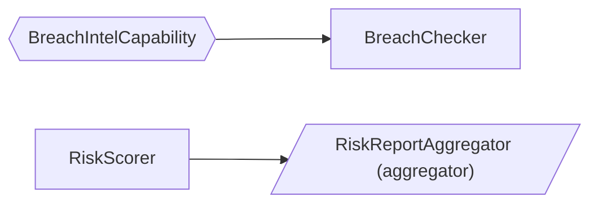

# orcastork (TypeScript)

[](https://github.com/Imper-ai/orcastork/actions/workflows/ci-typescript.yml)
[](https://nodejs.org/en/download)
[](LICENSE)

A **dataflow orchestration framework** for Node 22+ — a library, not a service. You describe a
graph of work, and it runs that graph per session: resumably, exactly once where it matters, and
across process restarts.

It is a **blackboard / dataflow** engine: `Operator`s consume and produce `DataPoint`s,
`Capability`s provide actions, `Aggregator`s write durable outputs, and a session-scoped
`Orchestrator` (supervised by a `SessionOrchestrationManager`) schedules work by **data
readiness** instead of fixed phases. The core is infrastructure-agnostic — it depends only on a
set of **ports** (interfaces); concrete backends are injected as **adapters**.

This package is a port of the [Python framework](../README.md), file for file and behaviour for
behaviour. The two are **wire-compatible**: a Python worker and a Node worker can share one Redis
and one MongoDB, and a session started by one can be resumed by the other. See
[Sharing a deployment with Python workers](#sharing-a-deployment-with-python-workers) for exactly
what that covers and the two caveats it carries.

## Install

```bash
npm install orcastork                 # core: no infrastructure required
npm install orcastork redis mongodb   # + the Redis and MongoDB adapters
```

`redis` and `mongodb` are **optional peer dependencies**. Install them only if you import
`orcastork/adapters/redis` or `orcastork/adapters/mongo`; every other entrypoint loads — and
type-checks — without them. Node **≥ 22**, ESM only (`"type": "module"`).

## Quickstart

Three classes and a runtime. Nothing here needs Redis, MongoDB or Docker — the in-memory adapters
are a complete implementation of every port, not a stub.

```ts
import {
  Aggregator,
  BaseDataPoint,
  FlowDefinition,
  NamespaceId,
  Operator,
  OperatorId,
  OperatorPolicy,
  SessionId,
  SessionOrchestrationManager,
  aggregator,
  buildInMemoryRuntime,
  dataPointType,
  operator,
  type DataPointEmission,
  type OperatorContext,
} from 'orcastork';
import { z } from 'zod';

// 1. The data. Identity is (type, value), so re-observing a value merges instead of duplicating.
@dataPointType('url', { pii: false, ephemeral: false }, { value: z.string() })
class UrlDataPoint extends BaseDataPoint<string> {}

@dataPointType('title', { pii: false, ephemeral: false }, { value: z.string() })
class TitleDataPoint extends BaseDataPoint<string> {}

// 2. The work. It runs because a URL exists, not because anything called it.
@operator
class TitleFetcher extends Operator {
  static readonly operatorId = OperatorId('title_fetcher');
  static readonly policy = OperatorPolicy({ rerunOnNewData: true });
  static readonly dependsOn = [UrlDataPoint];
  static readonly produces = [TitleDataPoint];

  public async *run(ctx: OperatorContext): AsyncIterable<DataPointEmission> {
    for (const url of ctx.store.ofType(UrlDataPoint)) {
      yield TitleDataPoint.emit(`Title of ${url.value}`);
    }
  }
}

// 3. The output. Aggregators are the only writers of curated durable state.
@aggregator
class TitleReport extends Aggregator {
  static readonly operatorId = OperatorId('title_report');
  static readonly policy = OperatorPolicy({ rerunOnNewData: false });
  static readonly dependsOn = [TitleDataPoint];

  public async aggregate(ctx: OperatorContext): Promise<void> {
    const titles = ctx.store
      .ofType(TitleDataPoint)
      .map((title) => title.value)
      .sort();
    await ctx.aggregation?.upsert('reports', 'titles', { titles });
  }
}

const runtime = buildInMemoryRuntime();
const manager = new SessionOrchestrationManager(runtime);
const flow = new FlowDefinition({ name: 'titles', operators: [TitleFetcher, TitleReport] });

const now = new Date();
const result = await manager.startSession({
  sessionId: SessionId('run-1'),
  namespaceId: NamespaceId('default'),
  flow,
  seed: [
    new UrlDataPoint({
      value: 'https://example.com',
      retrievedBy: OperatorId('seed'),
      firstRetrieved: now,
      lastRetrieved: now,
    }),
  ],
});

console.log('status:', result.status); // 'completed'
console.log('operator runs:', Object.fromEntries(result.operatorRuns)); // { title_fetcher: 1, title_report: 1 }
const record = await runtime.durable.read('reports', 'titles');
console.log('durable:', record?.document); // { titles: ['Title of https://example.com'] }
```

Nothing declared an order. `TitleFetcher` ran because a `UrlDataPoint` was present; `TitleReport`
ran because gathering went quiet and a `TitleDataPoint` existed. Add a third operator that depends
on `TitleDataPoint` and it schedules itself — you do not edit a pipeline, because there is no
pipeline to edit.

> [`tests/readme.test.ts`](tests/readme.test.ts) keeps this README honest, on every CI run. The two
> quickstarts and the reference guide's examples are **executed** there — the same code, with the
> imports pointed at `../src` and each `console.log` turned into an assertion on that exact value —
> and the wiring blocks that need a Redis, a Mongo or an OTel SDK are declared in the same file and
> compiled by `tsc` and biome without being run. A README that drifts from the code fails the build.

## Why this instead of a task queue or a workflow engine

- **Against a task queue** (BullMQ, Bee-Queue, Agenda): a queue runs the job you enqueue. Here you
  declare what an operator needs and the framework decides when it can run, so adding a step is
  adding a class, not rewiring a chain of callbacks.
- **Against a DAG scheduler** (Airflow, Dagster, Prefect): those schedule *batches* on a timetable,
  over a graph fixed at author time. orcastork schedules one *session* at a time, reactively, and a
  session can wait indefinitely for external input — release its process entirely while parked —
  and be picked up by a different process later.
- **Against a durable-execution engine** (Temporal, Restate, Inngest): those replay your code's
  history to recover, which constrains how you may write it and requires their server. orcastork
  recovers from durable *data* plus a fencing epoch, runs in your own process, and needs at most a
  Redis and a MongoDB — with a fully functional in-memory mode when it needs neither.

The trade is deliberate: you get data-driven scheduling, resumability and an audit trail without a
control plane to operate, and you give up cron-style batch scheduling and a built-in UI. You do
**not** give up cross-language workers — that is what the Python port buys (see
[Sharing a deployment with Python workers](#sharing-a-deployment-with-python-workers)).

## Looking for something smaller?

`orcastork/lite` ships in the same npm package and keeps only the scheduling core and the
dependency injection: operators, capabilities, readiness-driven reruns, retries, timeouts and cycle
bounding — no durability, resumability, epochs, inbox, aggregators, audit or telemetry. A session
lives and dies in one process and returns its DataPoints. There are no registries either: classes
are handed to the orchestrator, and DataPoints have no discriminator — the class *is* the type.

```ts
import {
  DataPoint,
  NamespaceId,
  Operator,
  OperatorId,
  OperatorPolicy,
  Orchestrator,
  SessionId,
  buildRuntime,
  type DataPointEmission,
  type OperatorContext,
} from 'orcastork/lite';

// 1. The data. Identity is (class, value) — the class is the type; there is no discriminator.
class Url extends DataPoint<string> {}

class Title extends DataPoint<string> {}

// 2. The work. It runs because a Url exists, not because anything called it.
class TitleFetcher extends Operator {
  static readonly operatorId = OperatorId('title_fetcher');
  static readonly policy = OperatorPolicy({ rerunOnNewData: true });
  static readonly dependsOn = [Url];
  static readonly produces = [Title];

  public async *run(ctx: OperatorContext): AsyncIterable<DataPointEmission> {
    for (const url of ctx.delta.added) {
      // incremental: only what is new since the last run
      if (url instanceof Url) {
        yield Title.emit(`Title of ${url.value}`);
      }
    }
  }
}

const now = new Date();
const seed = [
  new Url({
    value: 'https://example.com',
    retrievedBy: OperatorId('seed'),
    firstRetrieved: now,
    lastRetrieved: now,
  }),
];
const result = await new Orchestrator({
  sessionId: SessionId('run-1'),
  namespaceId: NamespaceId('default'),
  runtime: buildRuntime(),
  operators: [TitleFetcher],
  seed,
}).run();

console.log(Object.fromEntries(result.operatorRuns)); // { title_fetcher: 1 }
console.log(result.dataPoints.ofType(Title).map((title) => title.value));
// ['Title of https://example.com']
```

`SessionResult` carries `operatorRuns`, the final `dataPoints` view, `failures` (the last error of
each operator that failed with no retry left, or was cancelled) and `deadlineHit`. The one outbound
port is the `SessionEventSink`: the loop publishes a `DataPointMerged` per merge, an
`OperatorRunCompleted` per finished run, a `CapabilityActivated` per activation and one
`SessionCompleted`, so a consumer can follow a session it does not own. The default sink drops
them; `InMemorySessionEventSink` (`orcastork/lite/adapters/memory`) keeps them in a list, and
`RedisSessionEventSink` (`orcastork/lite/adapters/redis`) appends each to
`orcastork_lite:events:<sessionId>` — the same stream key, field layout and JSON the Python package
writes. A sink that raises is logged and the event dropped; publishing never stops the session.

The full description of what lite keeps and what it deliberately lacks is
[`orcastork_lite/README.md`](../orcastork_lite/README.md) — it applies here unchanged.

## Documentation

- **[This README](#contents)** — concepts, and the guides for writing an `Operator`, a `Capability`
  and an `Aggregator`.
- **[../docs/deployment.md](../docs/deployment.md)** — the operator's view: what to provision, the
  Redis keyspace and Mongo collections the adapters create, timeout tuning, and a pre-flight
  checklist. Its "TypeScript workers" section covers what differs here (almost nothing).
- **[CLAUDE.md](CLAUDE.md)** — the port's conventions contract: layout, the Python → TypeScript
  idiom table, and the rules a change here has to keep.
- **[../README.md](../README.md)** — the Python original, and the specification this port is held
  to.
- **[../CONTRIBUTING.md](../CONTRIBUTING.md)** — getting set up and what the checks expect.

## Status

Pre-1.0, and the API may still change — but it is not a sketch. The suite is 1,268 tests — one per
Python test that has a meaning here, and the three that do not are `it.skip`ped with the reason in
the test name rather than deleted (JavaScript has no task cancellation, no `asyncio.shield`, and no
runtime parameter names).
Every adapter family is held to one executable port contract (`tests/doubles/conformance/`), and the
invariants below are individually tested rather than merely intended. Breaking changes will be
listed in [../CHANGELOG.md](../CHANGELOG.md) with a migration.

## Licence

GPL-3.0-or-later — see [LICENSE](LICENSE). Copyright © Imper.AI.

---

# Reference guide

The rest of this document is the full guide: the concepts, then one section per thing you will
actually write.

## Contents

- [Core concepts](#core-concepts)
- [Operators vs Capabilities vs Aggregators — and what a full flow needs](#operators-vs-capabilities-vs-aggregators--and-what-a-full-flow-needs)
- [Guide: writing an Operator (and testing it)](#guide-writing-an-operator-and-testing-it)
- [Guide: writing a Capability (and testing it)](#guide-writing-a-capability-and-testing-it)
- [Guide: writing an Aggregator (and testing it)](#guide-writing-an-aggregator-and-testing-it)
- [Flows: `FlowDefinition`, fingerprints & drift detection](#flows-flowdefinition-fingerprints--drift-detection)
- [Guarding non-idempotent side effects: `ctx.once`](#guarding-non-idempotent-side-effects-ctxonce)
- [Operating a flow: replay, introspection, `orcastork-graph`](#operating-a-flow-replay-introspection-orcastork-graph)
- [Telemetry](#telemetry)
- [Rate limiting](#rate-limiting)
- [Ports & adapters](#ports--adapters)
- [Sharing a deployment with Python workers](#sharing-a-deployment-with-python-workers)
- [Invariants](#invariants)
- [Develop](#develop)

## Core concepts

| Concept | Role |
|---|---|
| `DataPoint` | The unit of data — a frozen value object; identity is `(type, value)` excluding timestamps, so re-observation dedups (keyed-merge). Concrete leaves are declared with `@dataPointType`. |
| `Operator` | Consumes/produces DataPoints (declares `dependsOn` / `uses` / `produces` / `requires` + a `policy`: rerun, debounce, timeout, retry); emits by `yield`ing from an `async *run`. One shape for fetching, deriving and deciding alike. |
| `Capability` | An injected action provider; declares its own deps; activated **lazily** when available (namespace-permitted + deps present + required caps available); resolved by the namespace's **preference order**; failed activations retry on a jittered cool-off. |
| `Aggregator` | An `Operator` run in the aggregation phase; the **sole** writer of *curated* durable outputs (idempotent, OCC, dead-lettered on repeated failure). Aggregators run **concurrently**, each attempt timeout-bounded, with the lease renewed between attempts. |
| `FlowDefinition` | Names a flow **once** — operators, capabilities, `completesWhen`, retry/parking policy, orchestrator tuning — so `startSession` / `resume` / `deliver` all drive the same definition. Its **fingerprint** detects flow drift on resume. |
| `CompletionCondition` | Declarative `completesWhen` — `TypePresent` combined with `allOf` / `anyOf` — deciding when a waiting session may aggregate. A bare DataPoint class is shorthand. |
| `ctx.once` (`EffectGuard`) | The claim/commit/revert guard around **non-idempotent side effects** (send an OTP, open a ticket) across reruns, retries and crash-resumes. |
| `DataPointArchive` | A **second** durable write path: the orchestrator live-archives every **non-ephemeral** DataPoint as its own keyed-upsert document (for debugging / replay / analytics), off the hot path via a write-behind buffer. |
| `Orchestrator` | One per session; holds a **fencing epoch**, the sole store mutator (via a local `SessionStateMirror`); gathers → waits/**parks** → aggregates → `COMPLETED`. |
| `SessionOrchestrationManager` | Spawns sessions from a `FlowDefinition`, mints epochs, resumes orphaned (crashed *or parked*) sessions; `deliver` is the crash-safe ingress front door. |
| `Telemetry` | Built-in OpenTelemetry: sync fire-and-forget metrics, **spans** and **logs** off the hot paths, no-op until a deployment wires an OTel SDK (OTel is itself the multi-backend layer — no port needed). |
| `RateLimiter` | Injected port with a no-op default (`NullRateLimiter`): fleet-level token-bucket pacing of capability actions. |

The mental model is a **blackboard**: a session has a shared, growing set of DataPoints. Operators
wake up whenever the data they need is present, run, and write more DataPoints back — which may in
turn wake other operators. There are no phases or hardcoded ordering; the dependency graph and data
readiness decide everything. When no operator has anything left to do (**quiescence**), the
aggregation phase runs and folds the gathered DataPoints into durable output — unless the flow
declares `completesWhen` and that condition isn't satisfied yet, in which case the session waits on
the inbox for mid-session input, and **parks** (releases the process entirely) if the wait stays
idle past `parkAfterMs` (see
[long-lived sessions](#long-lived-sessions-completeswhen-and-parking)).

**Durations are milliseconds**, everywhere, and a field or option carrying one ends in `Ms`
(`debounceMs`, `timeoutMs`, `parkAfterMs`, `operationTimeoutMs`). Python's `float` seconds and
`timedelta`s become `number` milliseconds with the same default values (30 s → `30_000`).

## Operators vs Capabilities vs Aggregators — and what a full flow needs

These three are the only things a flow author implements. Read this before the per-type guides — it
explains what each is *for* and how they fit together.

### The three component types at a glance

| | `Operator` | `Capability` | `Aggregator` |
|---|---|---|---|
| **What it is** | A unit of work that reads DataPoints and emits new ones. | A reusable *action provider* (an API client, a browser session, a threat-intel lookup) injected into operators. | An `Operator` subclass that runs after gathering and writes durable output. |
| **You implement** | `async *run(ctx: OperatorContext): AsyncIterable<DataPointEmission>` (`yield SomeDataPoint.emit(value)`, value only). | `async activate(ctx: CapabilityContext): Promise<void>` (build the underlying client from credentials). | `async aggregate(ctx: OperatorContext): Promise<void>` (fold DataPoints into durable state via `ctx.aggregation`). |
| **Produces** | DataPoints (drives further scheduling). | Nothing directly — it is *used by* operators via `ctx.capabilities.resolve(...)`. | Nothing (it is a sink); it writes to the `DurableStore`. |
| **When it runs** | During *gathering*, whenever it becomes ready and (optionally) on each new batch of relevant data; failed runs can retry on a loop-scheduled backoff. | Activated lazily the first moment it becomes *available*; constructed at most once per session (failed activations cool off and retry). | During the *aggregation* phase, once gathering quiesces; aggregators run concurrently. |
| **Identity** | `static operatorId` (unique; duplicate throws). | `static capabilityId` (unique; duplicate throws). | `static operatorId` (it is an operator). |
| **Declared with** | `@operator` | `@capability` | `@aggregator` (the same decorator as `@operator`, under a name that reads better) |
| **Availability gate** | Runs when all `dependsOn` DataPoints are present **and** all `requires` capabilities are available **and** the namespace permits it (catalog operator gating). | Available when namespace-permitted (catalog) **and** all `dependsOn` present **and** all `requires` capabilities available. | Same readiness rule as an operator. |

The key distinctions:

- **Operator vs Capability.** An operator is *work that runs once its inputs exist*; a capability is
  *a tool an operator reaches for*. An operator that needs to call an external API doesn't embed the
  client — it declares `static requires = [SomeCapability]` and calls
  `ctx.capabilities.resolve(SomeCapability)`. The framework decides when the capability is
  available, activates it from catalog credentials, and only then schedules the operator. This keeps
  operators infra-agnostic and capabilities reusable across operators.
- **Operator vs Aggregator.** A gathering operator *emits DataPoints* (which can trigger more work);
  an aggregator *consumes the final set and writes durable output* but emits nothing. Aggregators
  are the **only** components allowed to write durable state, and they get the
  idempotency/OCC/retry machinery (`ctx.aggregation`) that ordinary operators don't.

### Subtype substitution (declare against the abstract type)

`dependsOn` / `uses` / `produces` / `requires` are **subtype-aware**, through the prototype chain
exactly as Python's `issubclass` works through the MRO. If you declare
`static dependsOn = [EmailDataPoint]` and `EmailDataPoint` is an abstract intermediate, a
`WorkEmailDataPoint` *or* a `PersonalEmailDataPoint` leaf satisfies it. The same holds for
`requires = [IdpCapability]` resolving to whichever concrete IdP provider is available. Declare
against the broadest type that expresses your real dependency.

The type sets are declared as `readonly` arrays of **classes** (`static readonly dependsOn =
[UrlDataPoint]`); the engine dedups them into sets. They are declared on the class, not on the base,
so a subclass never has to write `static override` for a field it is the first to set.

### What a full flow needs

A runnable flow is five things — three you implement, two you declare/wire:

1. **DataPoints** — your domain's data types. Each concrete leaf extends `BaseDataPoint<ValueT>` and
   is decorated with `@dataPointType(type, config, options?)`, which pins the discriminator,
   declares the classification (`pii` / `ephemeral`) and registers the leaf. Group related leaves
   under an abstract intermediate for subtype substitution.
2. **Operators** — the gathering work (collectors, enrichers, detectors are all just operators). At
   minimum one operator that turns seed data into something.
3. **Aggregators** — at least one, to produce durable output. A flow with no aggregator gathers data
   and then completes having written nothing durable.
4. **Capabilities** — *optional*. Only if operators need injected action providers (external APIs,
   browser sessions). A pure data-transformation flow needs none.
5. **A `FlowDefinition`** — the flow named once: its components, completion condition and
   policy/tuning, all travelling together (see
   [the flows section](#flows-flowdefinition-fingerprints--drift-detection)).

Then you **wire** a runtime and run a session:

```ts
import { InMemoryCapabilityCatalog } from 'orcastork/adapters/memory';
import {
  CapabilityId,
  FlowDefinition,
  NamespaceId,
  SessionId,
  SessionOrchestrationManager,
  buildInMemoryRuntime,
} from 'orcastork';

const NAMESPACE = NamespaceId('acme');
// A flow maps its own id (a request, a job, a ticket) onto SessionId.
const SID = SessionId('order-4711');

// A catalog says which capabilities/operators each namespace may use and holds the credentials.
const catalog = new InMemoryCapabilityCatalog({
  permitted: [[NAMESPACE, [CapabilityId('breach_intel')]]],
  credentials: [
    { namespaceId: NAMESPACE, capabilityId: CapabilityId('breach_intel'), credentials: { api_key: 'secret' } },
  ],
});
const runtime = buildInMemoryRuntime(undefined, { catalog }); // in prod: build a Redis+Mongo runtime instead

const flow = new FlowDefinition({
  name: 'risk-report',
  operators: [RiskScorer, BreachChecker, RiskReportAggregator], // operators + aggregators together
  capabilities: [BreachIntelCapability], // the capabilities they may use
});

const manager = new SessionOrchestrationManager(runtime);
const result = await manager.startSession({
  sessionId: SID,
  namespaceId: NAMESPACE,
  flow,
  seed: [
    new EmailDataPoint({
      // the initial DataPoint(s)
      value: 'alice@acme.test',
      retrievedBy: OperatorId('seed'),
      firstRetrieved: new Date(),
      lastRetrieved: new Date(),
    }),
  ],
});
// result.status is SessionStatus.COMPLETED; result.operatorRuns, result.deadLetters, result.epoch
```

> The same `flow` object is what you pass to `manager.resume(...)`, `manager.reopen(...)` and
> `manager.deliver(...)` later — the definition travels, so a resume can never silently run
> different scheduling semantics (drift is fingerprint-detected and audited). You can also construct
> an `Orchestrator` directly (see the tests) — the manager just adds epoch minting, the scheduling
> gate, and orphan-resume on top. For production wiring, swap `buildInMemoryRuntime` for a
> Redis+Mongo runtime; the operators/capabilities/aggregators are identical across backends.

Operators, capabilities, and aggregators are passed as **classes**, not instances — the orchestrator
constructs a fresh, no-argument instance each time it runs one. **They must be stateless**: all
state lives in the DataPoint store (gathering) or the durable store (aggregation). Don't give them a
constructor with required arguments — configuration arrives through DataPoints, through a
capability's credentials, or through the catalog.

**Per-namespace operator gating.** Like capabilities, operators can be permitted per namespace:
`CapabilityCatalog.permittedOperators(namespaceId)` returns the allowed set, or `null` for
*unrestricted* (the default — an **empty set** means "run nothing", so unconfigured namespaces are
never silently disabled). A gated operator never launches and never counts for readiness or
quiescence; gating is runtime configuration, not flow identity, so it never reads as flow drift.

### Long-lived sessions: `completesWhen` (and parking)

By default a session completes at **quiescence** — the moment no operator has anything left to do.
That is right for machine-paced flows, but not for a flow that waits on a *human*: the answer
arrives minutes later, from another process. Declare that on the flow:

```ts
import { FlowDefinition, allOf, anyOf } from 'orcastork';

const flow = new FlowDefinition({
  name: 'challenge',
  operators: [ChallengePresenter, ChallengeReport],
  completesWhen: ChallengeOutcomeDataPoint, // a bare class is shorthand for TypePresent (subtype-aware)
  parkAfterMs: 120_000, // idle 2 minutes on the inbox wait → park (release the process)
  sessionDeadlineMs: 3_600_000, // ONE persisted wall-clock budget across parks/crashes/resumes
});
```

`completesWhen` accepts a DataPoint class or a declarative **completion condition** — a tiny AST of
`TypePresent` nodes combined with `allOf(...)` / `anyOf(...)` (`scheduling/completion.ts`).
Deliberately no callables: an AST can be inspected, compared and fingerprinted, where an opaque
predicate could only be executed. E.g.
`completesWhen: allOf(ChallengeOutcomeDataPoint, anyOf(ManagerApproval, AutoApproval))`.

Until the condition is satisfied, a would-be-quiescent session does not aggregate — it **waits on
the inbox** (event-driven push via `Inbox.waitForEntry`, no polling), keeps renewing its ownership
lease, and resumes the gather loop the moment input arrives. The wait is bounded by the **session
deadline**; on expiry, aggregation runs on whatever was gathered (the aggregator decides what an
incomplete session means). `completesWhen: null` (the default) is exactly the
complete-at-quiescence behavior.

**Parking.** Holding a task, a subscription and a renewing lease for an hours-long
human-in-the-loop wait would waste the process. With `parkAfterMs` set, an inbox wait that stays
*continuously* idle past that window **parks** instead: the run returns `SessionStatus.PARKED`
without aggregating or marking complete, releasing the process, the subscription and the lease
(audited as `SESSION_PARKED`). A parked session holds no lock and is not complete, so it looks
exactly like an orphan: `manager.deliver(...)` (or `resume`) re-drives it when input finally lands.
The session deadline is persisted in **wall-clock** terms at the first gather and rehydrated by
every later run, so a repeatedly-parked (or crash-looping) session consumes one shrinking budget —
never a fresh window per process.

The split to remember: **asking is an action, answering is data**. An operator *presents* a question
through a capability (machine-paced, returns immediately); the *answer* enters through the inbox as
a full DataPoint appended by your ingress (HTTP handler, webhook receiver). Never hold a connection
open inside an operator waiting for a human — the per-operation timeout will (rightly) abort it via
`ctx.signal`, and the wait would die with the process. Inbox entries are durable: they survive a
crash, and a resumed session drains them before re-planning.

**Crash-safe delivery.** In an ingress, prefer `manager.deliver(...)` over a bare `inbox.append`:

```ts
await manager.deliver({ sessionId, namespaceId, flow, dataPoint: chatAnswer });
```

It appends durably first, then makes sure *some* orchestrator processes the entry — a live owner is
woken by the inbox push; an orphaned **or parked** session (no lock, not complete) is resumed right
there on the delivering process under a fresh fencing epoch, with one deferred recheck covering an
owner that died (or parked) in the delivery window. Losing a resume race never throws — exactly one
process drives the session, and redelivery is harmless (reclaim + keyed-merge apply each entry once
in effect). Pass `reopenIfComplete: true` when late data must still affect an already-completed
session's durable result; that is the caller's explicit declaration, never a default. A host-level
periodic re-drive of its open sessions remains the backstop for double failures.

The next three sections are the full authoring + testing guide for each type.

---

## Guide: writing an Operator (and testing it)

An operator is a stateless class that declares what data it needs and produces, then emits
DataPoints from a single async-generator method.

### 1. Define the DataPoints it consumes and produces

```ts
import { BaseDataPoint, dataPointType } from 'orcastork';
import { z } from 'zod';

@dataPointType('email', { pii: true, ephemeral: false }, { value: z.string() })
class EmailDataPoint extends BaseDataPoint<string> {}

@dataPointType('risk_score', { pii: false, ephemeral: false }, { value: z.number() })
class RiskScoreDataPoint extends BaseDataPoint<number> {}
```

`@dataPointType(type, config, options?)` pins the discriminator, declares the classification
(`pii` → redacted in the audit unless a cipher is wired; `ephemeral` → never persisted) and
registers the leaf. The optional `{ value: <zod schema> }` is the value contract, checked on
construction and when a serialized payload is parsed — which is where a malformed inbox entry is
caught. Omit it and the type accepts anything (`z.unknown()`).

A duplicate discriminator throws `DuplicateRegistrationError` at class-definition time, as in
Python. A leaf with no `config` anywhere on its chain throws `InvalidDataPointError` there too. One
thing the port cannot do at definition time is catch a concrete class that was simply *never
decorated*: an undecorated TypeScript class runs no code at all, so that mistake surfaces at first
use — constructing or emitting it throws `InvalidDataPointError`.

For a substitution group, use `@abstractDataPoint` on the shared parent — or just leave it
undecorated, since `instanceof` and the graph read the prototype chain either way. Decorate it when
the intermediate carries a shared `config` or value contract its leaves should inherit:

```ts
import { BaseDataPoint, abstractDataPoint, dataPointType } from 'orcastork';

@abstractDataPoint({ pii: true, ephemeral: false }, { value: z.string() })
abstract class EmailDataPoint extends BaseDataPoint<string> {} // an intermediate, not a union member

@dataPointType('work_email')
class WorkEmailDataPoint extends EmailDataPoint {} // a leaf in the group; config is inherited
```

### 2. Implement the operator

```ts
import {
  Operator,
  OperatorId,
  OperatorPolicy,
  operator,
  type DataPointEmission,
  type OperatorContext,
} from 'orcastork';

@operator
class RiskScorer extends Operator {
  static readonly operatorId = OperatorId('risk_scorer'); // registry key + provenance (unique)
  static readonly policy = OperatorPolicy({ rerunOnNewData: false }); // NO default — you must choose
  static readonly dependsOn = [EmailDataPoint]; // runs once an Email is present (subtype-aware)
  static readonly produces = [RiskScoreDataPoint]; // declares the graph edge it creates

  public async *run(ctx: OperatorContext): AsyncIterable<DataPointEmission> {
    for (const email of ctx.store.ofType(EmailDataPoint)) {
      // subtype-aware: also returns Work/Personal leaves
      yield RiskScoreDataPoint.emit(email.value.endsWith('@acme.test') ? 0.9 : 0.1); // value only
    }
  }
}
```

An operator yields **value-only emissions** via `SomeDataPoint.emit(value)`: it declares *what* it
observed (the concrete leaf type + its value) and nothing else. The orchestrator owns provenance —
when it writes the result to the store it stamps `retrievedBy` (= this operator) and the observation
time (`firstRetrieved`/`lastRetrieved` = the session clock's `now()`). An operator never constructs
or sees those bookkeeping fields. (Seed and inbox DataPoints are *full* DataPoints — they carry
genuine external provenance from before/outside the session.)

What you get on the `ctx` (`OperatorContext`):

- `ctx.store` — a `DataPointView` over the current session state: `ctx.store.ofType(T)` (all
  matching, subtype-aware), `ctx.store.latest(T)` (newest by `lastRetrieved`, or `null`),
  `ctx.store.all()`, `ctx.store.size`, and `for (const dp of ctx.store)`. `ctx.latest(T)` is a
  shorthand for `ctx.store.latest(T)`.
- `ctx.capabilities` — a `CapabilityView`: `resolve(CapType)` (the preferred available provider, or
  `null` — providers in the namespace's preference order win first, in listed order; unlisted ones
  rank after, on a stable code-unit tie-break), `require(CapType)`, `isAvailable(capabilityId)`,
  `availableIds()`, `availableTypes()`.
- `ctx.delta` — an `InvocationDelta` of what changed *since this operator last ran*: `added`,
  `updated`, `newlyAvailableCaps`, `isFirstInvocation`. Use it to do incremental work on a rerun
  instead of re-scanning the whole store.
- `ctx.once(key, body, options?)` — the guard around non-idempotent side effects (sending an OTP,
  opening an ITSM ticket): `await ctx.once('send-otp', async (acquired) => { … })` — perform the
  effect iff `acquired` is `true`. A clean return commits the claim durably; a body that throws
  reverts it so a retry re-runs the effect. Durable across reruns, retries and crash-resumes; keys
  are namespaced per operator. See [the effects guard section](#guarding-non-idempotent-side-effects-ctxonce).
- `ctx.signal` — an `AbortSignal` aborted when this run is cut short (its timeout fired, or the
  session deadline passed). This has no Python counterpart: `asyncio` cancels the task, while a
  JavaScript promise cannot be cancelled, so anything genuinely in flight inside `run` — a `fetch`,
  a socket read, a `clock.sleep` — should be tied to the signal. Emissions already yielded are kept
  either way.
- `ctx.sessionId`, `ctx.epoch`, `ctx.isFinal` — identifiers and the finalize-pass flag (you rarely
  need these directly).

### 3. Choose the scheduling policy deliberately

`OperatorPolicy` has **no default** for `rerunOnNewData` — pick on purpose:

- `rerunOnNewData: false` — run **once** when first ready. Right for a one-shot enrichment (an email
  never changes how this operator scores it).
- `rerunOnNewData: true` — rerun whenever relevant new data arrives (new `added`/`updated`
  DataPoints or a newly-available capability). Right for a detector that should re-evaluate as
  evidence accumulates. Reruns are **coalesced** on a debounce window (`debounceMs` overrides the
  global default, which is `DEFAULT_DEBOUNCE_MS` = `0`).
- `rerunOn: RerunOn.ADDED_ONLY` — consulted only when `rerunOnNewData` is `true`: ignore
  freshness-only re-observations of an existing `(type, value)` identity (`delta.updated`), so
  chatty re-observation can't keep re-triggering a pure value-computation operator. The default,
  `RerunOn.ADDED_OR_UPDATED`, also reruns on freshness bumps. A newly-available capability always
  warrants a rerun, under either mode.
- `maxCycles: N` — required if the operator sits on a dependency **cycle** (A produces what B
  consumes and vice-versa). The circuit breaker caps iterations at `N` so the loop can't run
  forever. Without it, a cycle is rejected at construction with `UnboundedCycleError`.
- `timeoutMs` — per-operator override of the orchestrator's global `operationTimeoutMs`
  (`DEFAULT_OPERATION_TIMEOUT_MS` = `30_000`), in either direction (a wrapped streaming collector
  legitimately runs far longer than a quick scoring operator).
- `retry: RetryPolicy({ maxAttempts, baseDelayMs, jitter })` — bounded relaunch-on-failure for a
  gathering operator: a failed run is relaunched on a **loop-scheduled** jittered backoff window
  (like a debounced rerun — never an in-task sleep, so lease renewal, the deadline and inbox
  draining stay live throughout). The failed attempt's watermark is *not* advanced, so the relaunch
  re-presents the same delta; its already-merged emissions are harmless to re-emit (keyed-merge).
  `null` (the default) abandons the operator after a single failed run.

`uses` is the fourth type set: data the operator **reads but does not require**. New data of a
`uses` type re-triggers a `rerunOnNewData` operator exactly like `dependsOn`, but its absence never
blocks readiness — declare there every consumed type that is optional or may arrive late.

### 4. Using a capability from an operator

If your operator needs an injected action provider, declare it and resolve it at runtime:

```ts
@operator
class BreachChecker extends Operator {
  static readonly operatorId = OperatorId('breach_checker');
  static readonly policy = OperatorPolicy({ rerunOnNewData: false });
  static readonly dependsOn = [EmailDataPoint];
  static readonly requires = [BreachIntelCapability]; // won't run until this cap is available
  static readonly produces = [BreachCountDataPoint];

  public async *run(ctx: OperatorContext): AsyncIterable<DataPointEmission> {
    const intel = ctx.capabilities.require(BreachIntelCapability); // gated by `requires`
    for (const email of ctx.store.ofType(EmailDataPoint)) {
      // typed call; audited, paced and traced at the seam
      yield BreachCountDataPoint.emit(await intel.breachCount(email.value));
    }
  }
}
```

Use `require(Cap)` when the operator declares `Cap` in `requires` (readiness guarantees it is
available, so there is no `null` to handle; it throws `CapabilityUnavailableError` otherwise); use
`resolve(Cap): Cap | null` for a capability you use opportunistically without declaring. Either way
you get the real instance and call its action methods directly — fully typed, no string dispatch.
When several concrete providers of the same abstract capability are available, both pick the
namespace's **preferred** one (catalog `preferredOrder`).

### 5. Fault isolation (what happens when an operator fails)

A `run` that throws or exceeds its per-operation timeout is **isolated**: any DataPoints it already
emitted are persisted, the failure is logged and audited, and the scheduler proceeds — one operator
never wedges the session. If the policy declares `retry`, the loop relaunches it on a jittered
backoff (bounded by `retry.maxAttempts`, and a tripped cycle breaker is always terminal). So emit
incrementally (`yield` as you go) rather than building an array and emitting at the end. Emissions
stream through a **bounded queue** (`emissionQueueSize`, `DEFAULT_EMISSION_QUEUE_SIZE` = `1024`): a
runaway streaming operator is backpressured — suspended until the loop drains — instead of growing
the heap without limit, while its timeout keeps ticking.

### 6. Testing an operator

**Unit level** — drive `run` with a hand-built context, no orchestrator. Fast and precise:

```ts
import { InMemoryDataPointStore } from 'orcastork/adapters/memory';
import {
  CapabilityView,
  DataPointView,
  EffectGuard,
  Epoch,
  InvocationDelta,
  OperatorContext,
  OperatorId,
  SessionId,
} from 'orcastork';

it('flags an internal domain', async () => {
  const at = new Date('2026-01-01T00:00:00.000Z');
  const observed = new EmailDataPoint({
    value: 'alice@acme.test',
    retrievedBy: OperatorId('seed'),
    firstRetrieved: at,
    lastRetrieved: at,
  });
  const ctx = new OperatorContext({
    sessionId: SessionId('t'),
    epoch: Epoch(1),
    store: new DataPointView([observed]),
    capabilities: new CapabilityView(), // empty — no caps needed here
    delta: InvocationDelta({
      added: [observed],
      updated: [],
      newlyAvailableCaps: [],
      isFirstInvocation: true,
    }),
    effects: new EffectGuard(new InMemoryDataPointStore(), {
      sessionId: SessionId('t'),
      operatorId: OperatorId('risk_scorer'),
      epoch: Epoch(1),
    }),
    signal: new AbortController().signal,
  });

  const emitted: DataPointEmission[] = [];
  for await (const emission of new RiskScorer().run(ctx)) {
    emitted.push(emission); // drain the generator → value-only emissions
  }

  expect(emitted.map((emission) => [emission.leafType, emission.value])).toEqual([[RiskScoreDataPoint, 0.9]]);
});
```

**End-to-end** — run a real (in-memory) session and assert the resulting state. Use a `FakeClock` so
time is deterministic:

```ts
import { NamespaceId, Orchestrator, SessionId, SessionStatus, buildInMemoryRuntime } from 'orcastork';
import { FakeClock } from './doubles/clock.js'; // or your own copy of the tiny FakeClock

it('runs once and emits', async () => {
  const clock = new FakeClock();
  const runtime = buildInMemoryRuntime(clock);
  const seed = new EmailDataPoint({
    value: 'alice@acme.test',
    retrievedBy: OperatorId('seed'),
    firstRetrieved: clock.now(),
    lastRetrieved: clock.now(),
  });

  const result = await new Orchestrator({
    sessionId: SessionId('s'),
    namespaceId: NamespaceId('o'),
    runtime,
    operators: [RiskScorer],
    seed: [seed],
  }).run();

  expect(result.status).toBe(SessionStatus.COMPLETED);
  expect(result.operatorRuns.get(OperatorId('risk_scorer'))).toBe(1); // ran exactly once
  const scores = (await runtime.store.snapshot(SessionId('s'))).ofType(RiskScoreDataPoint);
  expect(scores.map((score) => score.value)).toEqual([0.9]);
});
```

> **Test-registry hygiene.** DataPoints, operators and capabilities self-register by id at
> class-definition time, and a duplicate id throws. If a test defines *throwaway* classes,
> snapshot/restore the registries around each test — `tests/setup.ts` (a vitest `setupFiles`) does
> exactly that for this suite, and `tests/doubles/operators.ts::makeOperator` mints a fresh
> registered subclass per call. Module-level production types defined once need no isolation.

---

## Guide: writing a Capability (and testing it)

A capability wraps an external action provider (an API client, an authenticated browser, a
threat-intel service) so operators can use it without embedding infrastructure. The framework
decides *when* it is available, activates it lazily from catalog credentials, and hands it to
operators that `requires` it.

### 1. Implement the capability

```ts
import { Capability, CapabilityId, capability, type CapabilityContext } from 'orcastork';

@capability
class BreachIntelCapability extends Capability {
  static readonly capabilityId = CapabilityId('breach_intel'); // unique registry key
  static readonly dependsOn = [EmailDataPoint]; // only available once an Email exists
  // static readonly requires = [SomeBaseCapability];  // layered caps: built after their base

  private client!: BreachIntelClient;

  public async activate(ctx: CapabilityContext): Promise<void> {
    // Build the real client from catalog-supplied credentials. Called at most once per session,
    // the first moment this capability becomes available.
    this.client = new BreachIntelClient(ctx.credentials.api_key as string);
  }

  /** An action — a public async method, so it is audited, paced and traced at the seam. */
  public async breachCount(email: string): Promise<number> {
    return await this._lookup(email);
  }

  /** Underscored helper — not an audited action. */
  public async _lookup(email: string): Promise<number> {
    return await this.client.lookup(email);
  }
}
```

What you implement and what you get:

- **`activate(ctx)`** is the one required method. `ctx.credentials` is the mapping the
  `CapabilityCatalog` holds for `(namespaceId, capabilityId)`; `ctx.store` is the current
  `DataPointView` (read-only). Build your client here — don't do it in the constructor (the
  framework constructs the capability with no arguments).
- **Action methods** (like `breachCount`) are your own **typed** API. Operators get the instance via
  `ctx.capabilities.resolve(...)` / `require(...)` and call them directly, so call sites are
  statically checked. Auditing is intrinsic: every **public async method** (other than `activate`)
  is wrapped when the class is declared to record the call — capability id, action name, arguments —
  in the audit log *before* it runs, so it can't be forgotten or bypassed. The same seam paces each
  action through the injected fleet [`RateLimiter`](#rate-limiting) (when one is configured)
  *before* the invocation is recorded — the trail holds only actions that actually proceeded — and
  opens a `capability.action` span around the whole call.
- **"Public" is decided by the name.** TypeScript's `private`/`protected` do not exist at runtime,
  so the wrapper reads a leading underscore as "internal" (like `_lookup` above). The decorator
  walks the whole prototype chain up to `Capability`, so a concrete provider under an *undecorated*
  abstract family still has that family's actions audited.
- **No public synchronous methods.** A public method the audit wrapper cannot cover (a sync method,
  or an async generator) would be an action that silently bypasses the audited seam — it is rejected
  at class definition with `InvalidCapabilityError`. Make it async, or underscore it.

### 2. Availability and lazy activation (the rules)

A capability is **available** iff all three hold:

1. it is **namespace-permitted** — in `CapabilityCatalog.permittedCapabilities(namespaceId)`;
2. all its **`dependsOn`** DataPoints are present (subtype-aware); and
3. all its **`requires`** capabilities are available (this makes availability a *fixpoint* — layered
   capabilities are activated base-before-layer).

Consequences worth knowing:

- **Lazy** — a capability that never becomes available is **never constructed**; `activate` isn't
  called.
- **Monotonic within a session** — DataPoints are only ever added, so once available a capability
  stays available unless the **namespace config** changes. A revocation blocks *new* resolutions but
  does not destroy an already-activated instance (in-flight users aren't interrupted).
- **Activation failure is isolated and retried** — if `activate` throws, the capability stays
  unavailable, the session continues without it, and a later availability refresh re-attempts the
  activation once a **jittered cool-off** has elapsed (the shared backoff schedule, seeded on the
  capability id — eligibility is checked, never awaited). After the retry budget
  (`retryPolicy.maxAttempts`) is exhausted, the failure is **terminal** for the session and audited
  (`AuditKind.CAPABILITY_ACTIVATION_FAILED`) — a whole dependent subgraph silently disappearing must
  be visible in the trail. Activation itself is bounded by the operation timeout.
- **Preferred provider** — when several concrete providers of the same abstract capability are
  available, `resolve`/`require` pick by the namespace's `preferredOrder` (catalog): listed providers
  win in listed order, unlisted ones rank after on a stable code-unit tie-break.

### 3. Testing a capability

**Availability + activation** — drive a `CapabilityActivator` over the in-memory catalog, exactly as
the orchestrator does (the activator takes the injected clock — its activation cool-off arithmetic
runs against it):

```ts
import { InMemoryCapabilityCatalog } from 'orcastork/adapters/memory';
import { CapabilityActivator, CapabilityId, DataPointView, NamespaceId } from 'orcastork';
import { FakeClock } from './doubles/clock.js';

const NAMESPACE = NamespaceId('o');
const BREACH = CapabilityId('breach_intel');

it('activates only once an Email is present', async () => {
  const catalog = new InMemoryCapabilityCatalog({
    permitted: [[NAMESPACE, [BREACH]]],
    credentials: [{ namespaceId: NAMESPACE, capabilityId: BREACH, credentials: { api_key: 'secret' } }],
  });
  const activator = new CapabilityActivator(
    [[BreachIntelCapability.capabilityId, BreachIntelCapability]],
    catalog,
    NAMESPACE,
    new FakeClock(),
  );

  const noEmail = await activator.refresh(new DataPointView([])); // dep missing
  expect(noEmail.isAvailable(BREACH)).toBe(false); // → not available, not constructed

  const withEmail = await activator.refresh(new DataPointView([anEmail]));
  expect(withEmail.isAvailable(BREACH)).toBe(true); // available once the Email is present
  expect(withEmail.resolve(BreachIntelCapability)).not.toBeNull(); // and resolvable by operators
});
```

Useful catalog levers in tests: `new InMemoryCapabilityCatalog({ permitted, credentials, preferred,
permittedOperators })` plus the mutators `setPermitted(namespaceId, caps)` /
`setCredentials(namespaceId, cap, creds)` / `setPreferredOrder(namespaceId, order)` /
`setPermittedOperators(namespaceId, ops)` to model a namespace changing its config between grants.
`computeAvailable({ registered, permitted, presentTypes })` lets you assert the pure availability
fixpoint directly; `new CapabilityView(new Map([[id, instance]]), [preferred])` lets you unit-test
`resolve` cardinality and the preference ranking.

**Layering** — share a `recordOrder` array across capabilities (see
`tests/doubles/capabilities.ts::makeCapability`) and assert base activates before layer.

**End-to-end** — the most realistic capability test asserts the *operator that uses it* produces the
right output when the capability is permitted. Wire both onto a runtime whose catalog permits the
capability, run the session, and check the durable/store result (as in the operator end-to-end test,
but add `capabilities: [BreachIntelCapability]` and a catalog that permits it). If the catalog does
**not** permit it, the requiring operator never runs — a good negative test.

---

## Guide: writing an Aggregator (and testing it)

An aggregator is an `Operator` the orchestrator runs in the **aggregation phase**, once gathering
quiesces. It is the **only** component that writes durable output, and it gets the idempotency / OCC
/ retry machinery to do so safely across crashes and re-drives.

### 1. Implement the aggregator

```ts
import { Aggregator, OperatorId, OperatorPolicy, aggregator, type OperatorContext } from 'orcastork';

@aggregator
class RiskReportAggregator extends Aggregator {
  static readonly operatorId = OperatorId('risk_report'); // it's an operator → operatorId
  static readonly policy = OperatorPolicy({ rerunOnNewData: false }); // still required
  static readonly dependsOn = [RiskScoreDataPoint]; // runs once risk scores are present
  // `produces` is typically empty — an aggregator is a sink and emits no DataPoints

  public async aggregate(ctx: OperatorContext): Promise<void> {
    const scores = ctx.store.ofType(RiskScoreDataPoint);
    const peak = scores.reduce((highest, score) => Math.max(highest, score.value), 0);
    await ctx.aggregation?.upsert('risk-reports', 'risk-report', { peak_risk: peak, count: scores.length });
  }
}
```

You implement **`aggregate(ctx)`**, not `run` — the `Aggregator` base drives `aggregate` and yields
nothing. The difference from an ordinary operator is `ctx.aggregation`, an `AggregationHelpers`
bound to this `(session, operator, epoch)` with three durable writes. It is `null` for a gathering
operator, which is why the examples write `ctx.aggregation?.…`. The first argument is the
**destination `table`** — the output model's `tableName`, which decides the collection the write
lands in (the adapter routes by it):

- **`await ctx.aggregation.upsert(table, key, document)`** — optimistic-concurrency upsert: it reads
  the current version, then writes guarded by it. Concurrent writers to the same key don't lose
  updates; on a version clash it throws `OptimisticConcurrencyError` and the aggregator is retried
  (see below). Returns the new version.
- **`await ctx.aggregation.addToSet(table, key, fieldName, value)`** — idempotent set-add (set
  *cardinality*, never a double-counting increment). Re-adding the same value is a no-op. Right for
  "this session contributed to namespace profile X".
- **`await ctx.aggregation.markContribution()`** — records that this session+operator contributed;
  returns `false` if already recorded. The orchestrator already gates on this (a completed
  aggregator is skipped on resume), but it's available if you need it directly.

`upsert` stamps a `status` (`AggregateStatus`) alongside the document, and **`final` is terminal**:
a non-final write over an already-final record is refused. That is what keeps an `interimRefresh`
aggregator — one that opts into running during gathering too — from walking a finalized record back
to `in_progress`.

### 2. The guarantees you're relying on

- **Concurrent, isolated peers.** Aggregators are independent by design, so they run
  **concurrently** — one waiting out a retry backoff never delays its peers. Each attempt is bounded
  by the aggregator's `policy.timeoutMs` (falling back to the orchestrator's operation timeout), and
  the ownership lease is renewed after every attempt, so a slow aggregator plus backoff can't
  outlive the lock TTL.
- **At-most-once contribution.** The orchestrator records a contribution marker after a successful
  aggregate; on a re-drive (resume, or a redundant second run of the same session) a completed
  aggregator is **skipped**. So make `aggregate` *idempotent* and lean on `upsert`/`addToSet` rather
  than blind increments — a redelivery must not double-count.
- **Bounded retry, then dead-letter.** If `aggregate` throws (e.g. an OCC conflict under
  contention), it's retried with jittered exponential backoff per the `RetryPolicy`. After
  `maxAttempts` it is **dead-lettered**: the session still reaches `COMPLETED` and a `DeadLetter`
  (`{ operatorId, reason }`) is recorded in `result.deadLetters` for manual re-drive. **Other
  aggregators are unaffected** — one failing report doesn't sink the others.
- **Epoch-fenced.** Every durable write carries the session's fencing epoch; a superseded (fenced)
  predecessor can't write.
- **A never-ready aggregator is reported, not silent.** If its `dependsOn` never materialize, the
  aggregator is skipped: the session still completes, a WARNING is logged, and the audit trail
  records an `OPERATOR_INVOKED` entry with outcome `skipped` naming the missing dependencies — an
  unwritten output domain is always visible.

Tune retries per flow via `RetryPolicy({ maxAttempts, baseDelayMs, jitter })`, declared as
`new FlowDefinition({ retryPolicy })` (or passed to `new Orchestrator({ retryPolicy })` when
constructing one directly). The same policy also sets the capability-activation retry budget.

### 3. Testing an aggregator

**Direct** — build the durable-write API over an in-memory durable store and call `aggregate`:

```ts
import { InMemoryDataPointStore, InMemoryDurableStore } from 'orcastork/adapters/memory';
import {
  AggregationHelpers,
  CapabilityView,
  DataPointView,
  EffectGuard,
  Epoch,
  InvocationDelta,
  OperatorContext,
  OperatorId,
  SessionId,
} from 'orcastork';

it('writes the peak', async () => {
  const durable = new InMemoryDurableStore();
  const clock = new FakeClock();
  const at = clock.now();
  const scores = [0.2, 0.9].map(
    (value) =>
      new RiskScoreDataPoint({
        value,
        retrievedBy: OperatorId('risk_scorer'),
        firstRetrieved: at,
        lastRetrieved: at,
      }),
  );
  const ctx = new OperatorContext({
    sessionId: SessionId('s'),
    epoch: Epoch(1),
    store: new DataPointView(scores),
    capabilities: new CapabilityView(),
    delta: InvocationDelta({ added: scores, updated: [], newlyAvailableCaps: [], isFirstInvocation: true }),
    effects: new EffectGuard(new InMemoryDataPointStore(), {
      sessionId: SessionId('s'),
      operatorId: OperatorId('risk_report'),
      epoch: Epoch(1),
    }),
    signal: new AbortController().signal,
    aggregation: new AggregationHelpers(durable, {
      sessionId: SessionId('s'),
      operatorId: OperatorId('risk_report'),
      epoch: Epoch(1),
      clock,
      isFinal: true,
    }),
  });

  await new RiskReportAggregator().aggregate(ctx);

  expect((await durable.read('risk-reports', 'risk-report'))?.document).toEqual({ peak_risk: 0.9, count: 2 });
});
```

**End-to-end** — run a full session and assert the durable output plus the failure surface:

```ts
const result = await new SessionOrchestrationManager(runtime).startSession({
  sessionId: SessionId('order-4711'),
  namespaceId: NAMESPACE,
  flow, // operators: [RiskScorer, BreachChecker, RiskReportAggregator]
  seed: [anEmail],
});

expect(result.status).toBe(SessionStatus.COMPLETED);
expect(result.deadLetters).toEqual([]); // it succeeded (not dead-lettered)
expect((await runtime.durable.read('risk-reports', 'risk-report'))?.document).toEqual({
  peak_risk: 0.9,
  count: 1,
});
```

For a **dead-letter** test, make `aggregate` throw, pass
`retryPolicy: RetryPolicy({ maxAttempts: 2, baseDelayMs: 0 })` (no real waiting), and assert the
session still `COMPLETED`, the failure is in `result.deadLetters`, and a *healthy* peer aggregator
still wrote its output. See `tests/aggregators.test.ts` for the full set (idempotent re-drive, OCC
no-lost-update, ephemeral exclusion, resume-skips-completed, seeded backoff).

**Adapter conformance** — if you implement a *new* `DurableStore` adapter, bind
`describeDurableStoreConformance(binding)` from `tests/doubles/conformance/durable_store.ts` to a
factory for it; the shared suite asserts OCC, idempotent set-add, contribution markers and epoch
fencing against your backend, so it stays behaviourally interchangeable with the in-memory one.

---

## Flows: `FlowDefinition`, fingerprints & drift detection

A `FlowDefinition` (`flow.ts`) names a flow **once** — its operators, capabilities, completion
condition, retry/parking policy and orchestrator tuning — so the manager's `startSession` / `resume`
/ `reopen` / `deliver` all drive the *same* definition instead of re-threading loose options that
callers must keep consistent across calls:

```ts
const flow = new FlowDefinition({
  name: 'risk-report',
  operators: [RiskScorer, BreachChecker, RiskReportAggregator],
  capabilities: [BreachIntelCapability],
  completesWhen: null, // or a DataPoint class / allOf(...) / anyOf(...)
  retryPolicy: null, // aggregator + capability-activation retry budget
  parkAfterMs: null, // ms of continuous inbox-wait idleness before parking
  // Orchestrator tuning the flow may pin; null falls back to the orchestrator defaults:
  operationTimeoutMs: null,
  sessionDeadlineMs: null,
  maxInboxDeliveries: null,
  emissionQueueSize: null,
});
```

`flow.fingerprint()` is a stable sha256 digest of the flow's **graph-shape identity**: each
operator's id, its `dependsOn`/`produces`/`requires` and the policy knobs that affect scheduling
semantics (`rerunOnNewData`, `rerunOn`, `maxCycles`); each capability's id and declarations; and the
completion condition's canonical text. Deliberately **not** covered: the flow name,
retries/parking/tuning (runtime behavior, not graph shape), and per-namespace operator gating
(runtime configuration — a namespace config change must never read as drift).

**The digest is byte-for-byte Python's.** The hashed text is the same, so a session started by a
Python worker resumes under a Node worker without reading as drift. The one input that cannot be
reproduced exactly is a class *name*: Python hashes `__qualname__`, which for a nested or
locally-defined class carries its enclosing scope (`test_x.<locals>.Provider`) where JavaScript
exposes only `Provider`. Top-level classes — everything a real flow declares — are identical in both.

The orchestrator persists the fingerprint per session and compares on every spawn: a resume whose
flow no longer matches (a deploy changed the operator set mid-session) logs a WARNING, records
`AuditKind.FLOW_DRIFT_DETECTED`, persists the new fingerprint, and **continues under the current
flow** — drift is *detected*, never pinned, because the idempotent dataflow model (keyed-merge,
watermarks, contribution markers) tolerates a changed operator set far better than a replay-based
engine would. A directly-constructed `Orchestrator` with no `flowIdentity` skips detection.

## Guarding non-idempotent side effects: `ctx.once`

Everything else the engine repeats is safe to repeat: emissions keyed-merge, archive writes
keyed-upsert, aggregator outputs are OCC-guarded and contribution-marked. A *side effect* (sending
an OTP, opening an ITSM ticket) is not — and gathering operators are deliberately re-driven: retried
on failure, rerun on new data, re-run on crash-resume. `ctx.once` is the explicit
claim/commit/revert guard such effects need (`operators/effects.ts`):

```ts
const address = ctx.latest(EmailDataPoint);
await ctx.once('send-otp', async (acquired) => {
  if (acquired && address !== null) {
    // this attempt owns running the effect
    await otp.send(address.value); // commit on a clean return; a throw reverts the claim
  }
});
```

Python's guard is an `async with ctx.once(key) as acquired:` block. JavaScript has no such
construct, so the block becomes a **callback**: `once(key, body, options?)` runs `body(acquired)`
exactly where the `async with` body would run, with the same claim before it and the same
commit/revert after it. The body runs whether or not this attempt acquired — `acquired` is a
parameter, not a gate — because that is what the Python block does, and a non-owning attempt must be
able to fail on its own unrelated work without touching the owner's mark. `once` also *returns*
whether the claim was acquired, for a caller that would rather branch after the block.

- **Entering claims** the `(operator, key)` durably (keys are namespaced per operator, so a shared
  key name never collides); `acquired` is `true` exactly once per key per session.
- **A clean return commits** the claim — the effect never fires again across reruns, retries and
  resumes.
- **A body that throws reverts** the claim and rethrows, so the loop-scheduled retry of this attempt
  re-enters with `true` and the effect actually runs — a failed attempt re-runs the effect instead
  of skipping it.
- **A predecessor's mid-effect crash** leaves a `pending` mark under a stale epoch — whether the
  effect actually happened is unknowable. The `{ onUnknown: EffectRecovery }` option decides:
  `EffectRecovery.RERUN` (the default) reclaims and re-runs — the framework's at-least-once posture,
  accepting a possible duplicate over a possibly-lost effect; `EffectRecovery.SKIP` leaves the stale
  mark in place, so a later resume sees the same unknown state and applies its own policy rather
  than a fabricated "committed".

Effect marks live in the `DataPointStore` (`claimEffect`/`commitEffect`/`revertEffect`), in a
separate keyspace from the DataPoint merge path, and every transition is epoch-fenced like any other
write — a fenced predecessor's mark is rejected, never half-applied.

## Operating a flow: replay, introspection, `orcastork-graph`

### Replaying an archived session (`replaySession`)

The archive persists every non-ephemeral DataPoint of a session. `replaySession` (`replay.ts`) makes
the promise behind it executable: reconstruct the raw DataPoints from those documents and drive a
(possibly different/newer) flow over them on a **fresh in-memory runtime** — re-deriving aggregates
and reprocessing raw signals without re-running collection. Use it for regression-testing a graph
change against a recorded session, what-if analysis, and computing new aggregates that didn't exist
when the session originally ran:

```ts
import { SessionStatus, replaySession } from 'orcastork';

const archived = await productionArchive.read(sessionId); // unseal PII values first on a real backend
const replay = await replaySession(archived, { flow: newFlow });

if (replay.result.status !== SessionStatus.COMPLETED) {
  throw new Error('the replayed flow did not complete');
}
const report = await replay.runtime.durable.read('risk-reports', 'risk-report'); // inspect any port
const newScores = replay.dataPoints.filter((dp) => dp instanceof RiskScoreDataPoint);
```

`ReplayResult` carries the `OrchestratorResult` (`result`), the fresh `runtime` it ran on (so you
can inspect the durable store / audit / archive directly), and the final `dataPoints`. When no
`catalog` is supplied, every flow capability is permitted with empty credentials — replay
reprocesses data that already arrived, so a replayed flow shouldn't need a live backend. An archived
entry whose `type` has no registered leaf in current code throws `UnknownDataPointTypeError` — a
meaningful replay failure, deliberately not skipped.

### Stuck-session forensics (`describeSession`)

`describeSession` (`introspection.ts`) answers "why is this session stuck / why this verdict" from
persisted state alone — **strictly read-only** (no epoch minted, no port mutated), so it is safe to
call while a live orchestrator owns the session. Readiness and missing-dependency names are computed
with the *same* pure functions the scheduler runs, so the description can never disagree with what
the engine would do:

```ts
import { describeSession, renderText } from 'orcastork';

const description = await describeSession(runtime, { sessionId, namespaceId, flow });
console.log(renderText(description));
```

```text
session verification-123 (flow risk-report): incomplete, unowned, epoch=2, revision=7, pending_inbox=0, quarantined=0, fingerprint=match
present: EmailDataPoint=1, RiskScoreDataPoint=1
- breach_checker: missing capabilities: BreachIntelCapability
```

`SessionDescription` exposes the structured form: `isComplete`/`isOwned`/`currentEpoch`/`revision`,
the persisted `deadline` and `storedFlowFingerprint` (+ `fingerprintMatches`), `pendingInbox` and
`quarantined` entries, `presentTypes` (per-type DataPoint counts), and one `OperatorState` per
operator (watermark, readiness now, missing data/capabilities by name, namespace-gating, and the
contribution marker for aggregators).

### Deploy-time graph validation (`orcastork-graph`)

The bounded-cycle rule otherwise only runs inside the `Orchestrator` constructor, once per session.
The `orcastork-graph` console script (`src/orcastork/tools/graph.ts`) imports your flow modules so
their operators/capabilities/DataPoints self-register, builds the full registry graph, validates the
cycle policy, and renders Mermaid so humans can see what CI is checking:

```bash
npx orcastork-graph -m ./dist/flows/operators.js -m ./dist/flows/capabilities.js --check
npx orcastork-graph -m ./dist/flows/operators.js --check --permitted breach_intel
npx orcastork-graph -m ./dist/flows/operators.js --mermaid -
```

`-m` takes a module specifier or a path, repeatably — it is dynamically `import()`ed, so it must be
something Node can load (a built `.js`, or a `.ts` under a loader). `--check` prints every cycle
found (bounded or not) and exits 1 on an unbounded one; `--permitted` takes comma-separated
`CapabilityId`s and validates the per-namespace subgraph with non-permitted capability nodes
dropped. With none of `--check`, `--mermaid` or `--permitted` the tool exits 2 rather than doing
nothing silently. The Mermaid output is deterministic (sorted nodes/edges), so a committed diagram
only diffs when the graph actually changes:



`orcastork-lite-graph` is the same tool for `orcastork/lite`. There are no registries there, so it
collects every concrete `Operator`/`Capability` class the named modules *export* instead of reading
a registry; the flags are identical. The library never imports either tool — a test enforces it.

## Telemetry

The framework's telemetry standard is **OpenTelemetry, built in** — the hot paths instrument
straight against the OTel API (`telemetry.ts`). There is no telemetry port: OTel is itself the
multi-backend abstraction (providers and exporters decide where the data goes), so a port would only
re-wrap it. `@opentelemetry/api` and `@opentelemetry/api-logs` are runtime dependencies, but without
an SDK every API call is a no-op — a deployment that configures nothing loses nothing. One that
wants the data installs `@opentelemetry/sdk-node` (or the individual SDK packages) and **must use
batching exporters** (`BatchSpanProcessor`, `PeriodicExportingMetricReader`,
`BatchLogRecordProcessor`): the orchestrator emits inline on its single gathering loop, so nothing
may await, lock or perform I/O on the calling path — batching keeps export off the loop, and a
telemetry outage degrades observability, never correctness.

The `Telemetry` class bundles the tracer, the OTel logger and every metric instrument the framework
emits (created once up front). It rides the runtime like every other injected dependency —
`OrchestratorRuntime({ telemetry })` / `buildInMemoryRuntime(clock, { telemetry })` — defaulting to
the process-global providers:

```ts
import { Telemetry, attachOtelLogBridge, buildInMemoryRuntime } from 'orcastork';

const runtime = buildInMemoryRuntime(clock, {
  telemetry: new Telemetry({ tracerProvider, meterProvider }), // omit for the global providers
});
attachOtelLogBridge({ level: 'INFO', moduleFilter: 'orcastork' }); // once per process
```

`attachOtelLogBridge` returns a bridge id; `detachOtelLogBridge(id)` undoes it and
`isOtelLogBridgeAttached()` reports whether one is installed. Tests inject per-test providers wired
to the SDK's in-memory exporters (the `TelemetryProbe` double in `tests/doubles/otel.ts`) and assert
counters, the span tree and log records through real OTel collection.

**Metrics** — counters and histograms, one instrument per name on the `Telemetry` bundle, and the
same names the Python package emits: `sessions_total{status}`,
`operator_runs_total{operator_id,outcome}` (riding the audit seam, so metrics and the audit trail
can never disagree), `operator_run_seconds`, `operator_retries_total`, `operator_reruns_total`,
`data_points_merged_total{kind}`, `inbox_entries_total{disposition}`,
`capability_activations_total{outcome}`, `aggregator_dead_letters_total`, `session_gather_seconds`,
`session_aggregation_seconds`, `session_deadline_hits_total`, `archive_flush_entries`.

**Spans** — opened through `withSpan(tracer, name, body, options?)`, which wraps
`tracer.startActiveSpan`; nesting follows OTel context, so operator-task spans parent under the
gathering loop's span. One session run produces one trace:

- `session.run` (`session_id`, `namespace_id`, `epoch`, final `status`) — the root
  - `session.gather`
    - `operator.run {operatorId}` (`outcome`; an isolated failure marks the span failed via
      `recordException` + `setStatus` without failing the trace)
    - `capability.activate {capabilityId}`
    - `capability.action {capabilityId}.{action}` — every action call, opened at the same audited
      seam that paces and records the invocation (argument values never land on it)
    - `session.inbox_wait` (`outcome`: `wakeup` / `deadline` / `parked`) — the potentially
      hours-long wait for mid-session input, visible in the trace with what ended it
  - `session.aggregate`
    - `aggregator.run {operatorId}` (`attempt`, `outcome`) — one span per retry attempt

The manager's ingress methods open `session.start` / `session.resume` / `session.reopen` /
`session.deliver` spans (with a `disposition` attribute), so an orchestrator run is traced back to
what drove it.

**Logs** — the framework logs through its own tiny `Logger` interface (`logging.ts`:
`getLogger()` / `setLogger()`, with a console-JSON default), which is the port of loguru;
`logging_bridge.ts` ships those records as OTel log records (kwargs as attributes, `exception.*`
attributes when an `Error` rides on the `error` or `exception` field, trace/span ids stamped from
the active span). Every framework record carries a **`logger_name`** field naming its origin module
(`orcastork.orchestrator.orchestrator`, `orcastork.adapters.mongo.datapoint_archive`, …) — the
counterpart of loguru's module name, and what `moduleFilter` matches on, so a host application that
routes its own records through the same logger can forward only the framework's.

Default lifecycle logging (all structured fields, all session-id-tagged): the orchestrator logs
`Session run started` / `Session completed` at INFO and the steps between at DEBUG (seed, operator
launches and successes, quiescence, aggregation start, aggregator completions, inbox
waits/wakeups/applies); failures keep their WARNING/ERROR records, and a session-deadline hit WARNs
with the operators still in flight. The manager logs its ingress dispositions. The capability audit
seams log `Capability activated` and `Capability action invoked` at DEBUG — parameter **keys** only,
mirroring the audit trail's redaction, and emitted inside the action span so bridged records
correlate with the trace.

**Metric attribute cardinality rule:** metric attributes must stay LOW-cardinality — values from
small, closed sets (`operator_id`, `capability_id`, `outcome`, `kind`, `disposition`). Per-session
identifiers (`session_id`, `namespace_id`) are **not** metric attributes — one time series per
session would explode the backend's series count. Span and log attributes are the opposite case:
each record stands alone, so per-session identifiers belong there.

## Rate limiting

One namespace's many concurrent sessions all call the same third-party APIs; nothing inside a single
session can see that pressure, so pacing is a shared, injected concern: the `RateLimiter` port
(`ports/rate_limiter.ts`). `acquire(key)` is a token bucket per key — it returns immediately while
budget remains and otherwise *waits* (through the backend's notion of time) until the action may
proceed. It never fails, it only paces.

The capability base class acquires at the **audited action seam** — every public async action method
paces before its invocation is recorded — so an operator cannot bypass it. The bucket key is
`{namespaceId}:{capabilityId}`: one namespace's fleet of sessions shares the budget for a provider,
while other namespaces and other providers are unaffected.

Wired via the runtime; the default is `NullRateLimiter` (no pacing).
`new InMemoryRateLimiter(clock, { ratePerSecond, burst })` is a single-process bucket on the
injected clock (deterministic under `FakeClock`); `new RedisRateLimiter(redis, clock, {
ratePerSecond, burst })` is an atomic Lua token bucket shared by every process of the fleet:

```ts
import { InMemoryRateLimiter } from 'orcastork/adapters/memory';

const runtime = buildInMemoryRuntime(clock, {
  rateLimiter: new InMemoryRateLimiter(clock, { ratePerSecond: 5, burst: 10 }),
});
```

## Ports & adapters

The core depends only on nine **ports** (`ports/`, all plain `interface`s). Concrete backends
implement them under `adapters/` and are bundled into an `OrchestratorRuntime` (the only thing the
orchestrator/manager depend on). You rarely call ports directly — operators use
`ctx.store`/`ctx.capabilities`/`ctx.once` and aggregators use `ctx.aggregation` — but here's the map:

| Port | Responsibility | Key methods |
|---|---|---|
| `DataPointStore` | Session-scoped, keyed-merge, monotonic-revision blackboard **+ the session's epoch-fenced meta state** (watermarks, effect marks, wall-clock deadline, flow fingerprint). | `write`, `applyResolved` (a sole-mutator's pre-resolved batch), `snapshot`, `revision`, `changeSetSince`, `get/setWatermark`, `claim/commit/revertEffect`, `getEffectState`, `get/setSessionDeadline`, `get/setFlowFingerprint` |
| `Inbox` | Durable, ordered, at-least-once ingestion of user-action DataPoints, + a push wakeup for waiting sessions; poison-tolerant delivery + quarantine. | `append`, `consume`, `reclaim`, `ack`, `quarantine`, `quarantined`, `pendingCount`, `waitForEntry(sessionId, signal?)` |
| `SessionLock` | Liveness lock **+ fencing epoch** (correctness) **+ completion flag**. | `acquire`→`Epoch`, `renew`, `release`, `currentEpoch`, `isHeld`, `markComplete`, `isComplete`, `clearComplete` |
| `AuditSink` | Durable, append-only event log; an append is replayable by the time it returns. | `append`, `appendMany` (one batch, atomically fenced), `replay` |
| `DurableStore` | Idempotent, OCC-guarded *curated* durable outputs, routed to the output model's `tableName`, + contribution markers. | `read`, `upsert`, `addToSet` (all by `table`), `markContribution`, `isContributionMarked`, `clearContribution` |
| `DataPointArchive` | Second durable write path: live, keyed-upsert raw DataPoints (off the hot path; PII sealed via an injected `ValueCipher`). | `archive`, `archiveMany` (one batch, atomically fenced), `flush`, `read`, `bufferedCount` |
| `CapabilityCatalog` | Per-namespace permitted capabilities **and operators** + credentials + provider preference. | `permittedCapabilities`, `permittedOperators` (`null` = unrestricted), `credentials`, `preferredOrder` |
| `CooldownGate` | Atomic, durable per-key cooldown backing the manager's `SchedulingGate` (cross-process, restart-safe). | `tryAcquire` |
| `RateLimiter` | Fleet-level token-bucket pacing of capability actions (waits, never fails). | `acquire` |

Every mutating method takes a fencing `epoch` (as `{ epoch }` on its options object) and rejects a
superseded write with `StaleEpochError` (the pacing-only `RateLimiter` is the deliberate exception —
it is not a state write; telemetry is not a port at all, see [Telemetry](#telemetry)). Adapter
families:

- **memory** (`orcastork/adapters/memory`) — deterministic, infra-free; the test/spike substrate.
  All nine ports (`InMemory*`, including `InMemoryRateLimiter` and `InMemoryCooldownGate`).
  `buildInMemoryRuntime()`.
- **redis** (`orcastork/adapters/redis`, peer `redis` ≥ 6) — node-redis directly: Lua-CAS store
  (incl. `applyResolved` and the effect keyspace), Streams inbox (consumer group + `XAUTOCLAIM`,
  poison-tolerant, durable quarantine), `SET NX PX` lease + monotonic `INCR` epoch, cooldown gate,
  atomic Lua token-bucket rate limiter.
- **mongo** (`orcastork/adapters/mongo`, peer `mongodb` ≥ 7) — the driver directly: OCC
  version-guarded durable store, append-only audit sink (`appendMany` allocates a contiguous
  sequence range under a **single meta CAS**, fencing the whole batch at once, then writes it
  straight to `orcastork-audit-log`), keyed-upsert DataPoint archive (`orcastork-datapoints`, PII
  sealed via the injected cipher, batch `archiveMany`).

**Constructing them.** Each Redis adapter takes a connected **node-redis client**, and each Mongo
adapter takes a driver **`Db`**. Nothing here imports the peer as a *value*: the Redis adapters are
typed against the commands they use (so any v5/v6 client instance fits) and the Mongo adapters
import types only — which is what lets the modules load, and type-check, wherever the peer is not
installed.

```ts
import { MongoClient } from 'mongodb';
import { createClient } from 'redis';
import { MongoAuditSink, MongoDataPointArchive, MongoDurableStore } from 'orcastork/adapters/mongo';
import {
  RedisCooldownGate,
  RedisDataPointStore,
  RedisRateLimiter,
  RedisSessionLock,
  RedisStreamsInbox,
} from 'orcastork/adapters/redis';
import { OrchestratorRuntime, SchedulingGate, SessionOrchestrationManager, SystemClock } from 'orcastork';

const redis = await createClient({ url: 'redis://localhost:6379' }).connect();
const database = new MongoClient('mongodb://localhost:27017').db('orcastork');

const clock = new SystemClock();
const runtime = OrchestratorRuntime({
  clock,
  store: new RedisDataPointStore(redis),
  inbox: new RedisStreamsInbox(redis),
  // ttlMs must exceed the longest unrenewed await — see "the completion tail is BOUNDED" below.
  lock: new RedisSessionLock(redis, { ttlMs: 60_000 }),
  audit: new MongoAuditSink(database),
  archive: new MongoDataPointArchive(database, { retentionMs: 30 * 86_400_000 }),
  durable: new MongoDurableStore(database),
  catalog, // your own CapabilityCatalog over your configuration store
  rateLimiter: new RedisRateLimiter(redis, clock, { ratePerSecond: 10, burst: 20 }),
});
const manager = new SessionOrchestrationManager(runtime, {
  schedulingGate: new SchedulingGate(new RedisCooldownGate(redis), { cooldownMs: 60_000 }),
});
```

Options worth knowing: the Redis adapters take `{ stateTtlMs }` (the sliding per-session key TTL,
`DEFAULT_STATE_TTL_MS` = 24 h) and the lock additionally `{ ttlMs }` (`DEFAULT_TTL_MS` = 30 s);
`MongoDataPointArchive` takes `{ cipher, cipherProvider, retentionMs }` and `MongoDurableStore`
`{ fencingTtlMs }`. PII sealing is an injected `ValueCipher` (`encrypt` / `decrypt` / a **keyed**
`mac`); the default `NullCipher` is a passthrough, and the Mongo archive **fails closed** — it
refuses to persist a PII value under an unkeyed `mac` with `UnprotectedPiiError` rather than writing
plaintext. A `NamespaceCipherProvider` resolves a cipher per namespace.

**Conformance.** The port contracts are executable suites — `describeStoreConformance`,
`describeInboxConformance`, `describeLockConformance`, `describeAuditSinkConformance`,
`describeDurableStoreConformance`, `describeDataPointArchiveConformance`,
`describeCooldownGateConformance` (`tests/doubles/conformance/`). They are *functions* that call
`describe`/`it` themselves, written against the port interface only; each adapter test file binds
them with a factory and an `advanceTime` callback. Every adapter family runs the same suite, so they
are behaviourally interchangeable. To add a backend, implement the port, register it in a runtime
builder, and bind the matching suite to it.

## Sharing a deployment with Python workers

Anything persisted or published keeps the Python package's **snake_case names, key names and
values**. TypeScript property names stay camelCase; the adapter maps at its boundary and nowhere
else. So a Python worker and a Node worker pointed at the same Redis and the same MongoDB are meant
to share one deployment: either can start a session, either can resume it, and either can read what
the other wrote. Each item below was checked against the Python source and its outputs (the Lua
scripts and key names by text, the canonical value and the flow fingerprint against values produced
by CPython); an end-to-end mixed-runtime session has not yet been run, so treat cross-runtime resume
as verified by inspection until you have rehearsed it on your own keyspace.

What is byte-compatible:

- **Redis keys** — `dp:`, `added:`, `upd:`, `rev:`, `epoch:`, `mint:`, `lock:`, `complete:`, `wm:`,
  `fx:`, `meta:`, `inbox:`, `inbox-wakeup:`, `acked:`, `quarantine:`, `cooldown:`, `ratelimit:`,
  each suffixed with the session id (or the gate/limiter key), exactly as
  [docs/deployment.md](../docs/deployment.md) tabulates them.
- **Lua scripts** — the CAS store apply, the effect keyspace transitions, the epoch-guarded inbox
  ack and quarantine, the token bucket: the same semantics and the same fencing verdicts.
- **Hash fields** — a DataPoint's store field is `{type}\x00{canonicalValue(value)}`, where
  `canonicalValue` is Python's `repr(_make_hashable(value))` reproduced byte for byte
  (`internal/python_repr.ts`), so both runtimes dedup onto the same field.
- **Inbox payloads** — the DataPoint's `model_dump(mode='json')` shape: `type`, `value`,
  `retrieved_by`, `first_retrieved`, `last_retrieved`, with ISO-8601 instants parsed from either `Z`
  or `+00:00`. The durable quarantine record keeps its `entry_id` / `reason` / `delivery_count` /
  `raw_payload` keys.
- **Mongo collections and documents** — `orcastork-datapoints`, `datapoint_archive_buffer`,
  `datapoint_archive_meta`, `orcastork-audit-log`, `audit_meta`, `contributions`,
  `contributions-fencing`, your own `tableName` collections and their `<table>-fencing` companions;
  the composite `_id` layouts (`session\x00type\x00value_hash`, `key\x00field`,
  `session\x00operator`) and the field names inside each document.
- **Audit rows and archive rows** — the same `kind` strings, the same sequence allocation under one
  meta CAS, the same `$setOnInsert`/`$max` fold. A trail written by one runtime replays in the other.
- **Flow fingerprints** — the hashed text is identical, so a resume across runtimes does not read as
  drift (see [the flows section](#flows-flowdefinition-fingerprints--drift-detection) for the one
  `__qualname__` caveat, which affects only locally-defined classes).
- **The lite event stream** — `orcastork_lite:events:<sessionId>`, field `kind` plus the event as
  JSON, the same `maxlen` trim and sliding TTL.

Two caveats, both documented rather than fixable:

1. **An integral float canonicalizes differently.** JavaScript has one number type, so a value a
   Python flow holds as `1.0` reprs as `1.0` there and as `1` here — a different identity, hence a
   different Redis hash field and a different archive key for the same logical DataPoint. (An
   integer beyond 2^53 has the same problem via `JSON.parse` rounding.) Everything else — the float
   digits, the fixed-vs-exponent rule, string escaping, key ordering — is exact and pinned against
   fixtures generated by CPython. If a flow shares DataPoints across runtimes, keep numeric values
   either genuinely integral or genuinely fractional, and never rely on `1.0` and `1` being distinct.
2. **`socketTimeout` must exceed the inbox keepalive.** The Redis inbox's wakeup runs on a
   subscribed connection of its own, and a session that receives no input for a long time would have
   its waiter die on the client's read deadline. Python keeps every read shorter than the deadline by
   polling the subscription on a 1 s interval; node-redis is push-driven and has no read to bound, so
   the adapter pings the connection on the same interval instead. node-redis is the stricter of the
   two: it treats the deadline as **fatal and does not reconnect**. So set `socketTimeout`
   comfortably above 1 s (the Python fleet's `socket_timeout` is 30 s — match it), or leave it unset;
   a value at or below the keepalive interval strands parked sessions on a dead subscription.

## Invariants

- **Fencing epoch** on every write path (store CAS and `applyResolved`, effect
  claim/commit/revert, session meta — deadline + flow fingerprint —, watermarks, durable OCC, audit
  append, archive, inbox ack/quarantine, session completion): a superseded epoch is rejected — no
  split-brain.
- **Keyed-merge dedup** makes re-emission and at-least-once delivery idempotent (including the
  archive's keyed-upsert, so redelivery/replay never duplicates an archived DataPoint). Identity is
  a canonical **string** (`dataPoint.identity`), because TypeScript has no structural hashing — the
  same string the Redis field and the archive key digest are built from.
- **Sole mutator, served locally.** The orchestrator is the only store writer while it holds the
  epoch, so it keeps a local `SessionStateMirror` (`orchestrator/mirror.ts`): rehydrated once per
  run, every hot-loop read served locally, every keyed-merge resolved locally and written through
  per drained batch via `DataPointStore.applyResolved`. The store stays the system of record **and
  the revision allocator** — a fenced forward throws *before* the local copy is touched, so the
  mirror can never run ahead of what the store accepted.
- **Two framework-owned persistence boundaries**: aggregators write *curated* outputs at finalize;
  the orchestrator *live-archives* raw non-ephemeral DataPoints (off the hot path, epoch-fenced,
  eventually consistent) — the archive is never read on a decision path.
- **Monotonic** store revision and capability availability.
- **No cancellation of a running operator by anything but time**: only its per-operation timeout (the
  policy override or the global default) or the session deadline stops it, and both stop it by
  aborting `ctx.signal` and calling `return()` on the generator — emissions already yielded are kept.
- **The injected `Clock` is the only time source.** Every window, deadline and TTL computation reads
  it, so a whole session runs deterministically under a `FakeClock`. The only real timers in the
  package are `SystemClock.sleep` and `internal/timeouts.ts::withTimeout` (the port of
  `asyncio.wait_for`, which must bound a real await); `tests/harness.test.ts` enforces that nothing
  else reads real time.
- **The completion tail is BOUNDED, not renewed.** Lease renewal stops when gathering returns, so
  `aggregate → flush → inbox re-check → markComplete` runs on the lease it already holds. Every tail
  step is individually bounded by `operationTimeoutMs` and throws `CompletionTailTimeoutError` rather
  than overrunning silently — which is why the lock TTL must exceed the longest single unrenewed
  await. Do not "fix" a tight margin with a background keepalive: renewing from a task that is not
  the one doing the work turns the lease from "this session is progressing" into "this process still
  has an event loop".
- **At-least-once, bounded.** Inbox delivery is at-least-once (crash-before-ack redelivers); a poison
  (unparseable) entry is **quarantined on sight**, and a valid entry whose apply keeps failing is
  redelivered only up to `maxInboxDeliveries` (`DEFAULT_MAX_INBOX_DELIVERIES` = 5) and then
  quarantined (audited as `INBOX_ENTRY_QUARANTINED`) — one bad message never crash-loops a session.
  Quarantined entries stay durably inspectable via `Inbox.quarantined`.
- **Bounded buffering**: the emission queue is bounded (`emissionQueueSize`), so a runaway streaming
  operator is backpressured instead of growing the heap; completion signals can be delayed but never
  lost.
- **Every owned run ends deterministically**: `COMPLETED` (aggregated + marked complete, even with
  failing aggregators — dead-lettered into `result.deadLetters`), `PARKED` (idle past `parkAfterMs`;
  not finalized, re-driven on delivery/resume), or `SUPERSEDED` (fenced by a higher epoch; a clean
  stop — the successor owns the session). The persisted wall-clock deadline is **one shrinking
  budget** across parks, crashes and resumes, so a waiting session always reaches aggregation
  eventually.

## Develop

Standalone npm package; the `Makefile` is the same four verbs the Python side has.

```bash
make deps              # npm ci
make lint              # biome check + tsc --noEmit
make test              # vitest run (spawns the servers it needs)
make test_integration  # vitest run --config vitest.integration.config.ts
make build             # tsc -> dist/
make pack              # npm pack — the tarball a consumer actually installs
```

The npm scripts underneath: `npm run lint` (`biome check . && tsc --noEmit`), `npm run fix_lint`
(`biome check --write .`), `npm test` (`vitest run`), `npm run test:integration`,
`npm run test:coverage`, `npm run typecheck`, `npm run build`. `npm pack` rebuilds through
`prepack` first, so a stale `dist/` can never be published, and `tests/package.test.ts` holds the
manifest to the source tree — every adapter family must have a subpath of its own, since the root
barrel deliberately leaves the adapters out so importing `orcastork` never loads an optional peer.

**The default suite needs no service you have to start.** The Redis adapter tests run against a real
`redis-server` the test setup spawns on a free port, and the Mongo adapter tests against
`mongodb-memory-server` — so an adapter test is evidence about the thing that will run in
production, not about a double. Point `ORCASTORK_TEST_REDIS_URL` / `ORCASTORK_TEST_MONGO_URL` at an
already-running server and the helpers use that instead of starting their own (a CI job with service
containers wants this). Without the `redis-server` binary the Redis suites skip with a loud warning;
CI is the gate, and nothing skips there.

Integration tests are `*.integration.test.ts` and excluded from `npm test`; run them with
`make test_integration`.

`tests/e2e.test.ts` (multi-process handoff, concurrent resume, layered capabilities, fault
isolation) and `tests/acceptance.test.ts` are worth reading as worked examples of assembling a flow.
[CLAUDE.md](CLAUDE.md) holds the conventions and the invariants a change must not break; read it
before writing code here.
